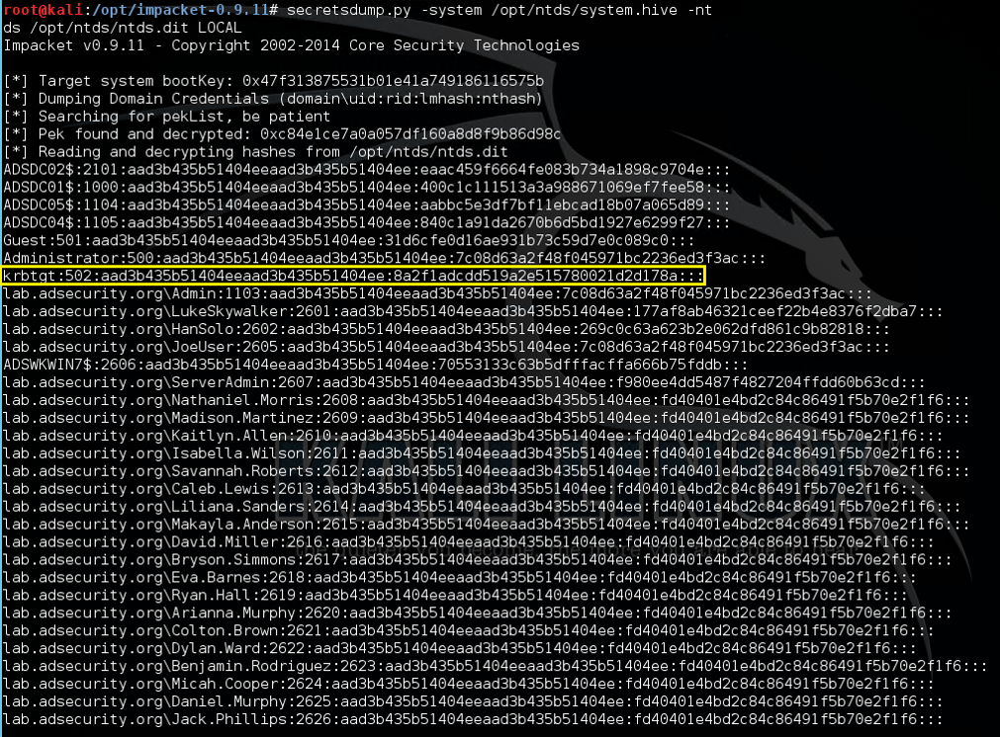

# Attack Techniques to go from Domain User to Domain Admin:
## 1. Passwords in SYSVOL & Group Policy Preferences
groups.xml, scheduledtasks.xml, & Services.xml
.vbs .bat .ps1
## 2. Exploit the MS14-068 Kerberos Vulnerability on a Domain Controller Missing the Patch (KB3011780)
check all DCs for this ... one of them may be unpatched
## 3. Kerberos TGS Service Ticket Offline Cracking (Kerberoast)
The encryption type of the requested Kerberos service ticket is RC4_HMAC_MD5 which means the service account’s NTLM password hash is used to encrypt the service ticket.
This means that Kerberoast can attempt to open the Kerberos ticket by trying different NTLM hashes and when the ticket is successfully opened, the correct service account password is discovered.
## 4. The Credential Theft Shuffle
Servers running applications such as Microsoft Exchange Client Access Servers (CAS), Microsoft Exchange OWA, Microsoft SQL, and Terminal Services (RDP) tend to have lots of credentials in memory from recently authenticated users (or services that likely have Domain Admin rights).

*connecting to a remote system via PowerShell remoting (either through Enter-PSSession or Invoke-Command) is a network logon – no credentials are stored in memory on the remote system*

*There is a way to connect to a remote system via PowerShell remoting and be able to use the credential by way of CredSSP. The problem is CredSSP is NOT SECURE.*

### Reason for the double-hop problem
The reason is that, by default, PowerShell remoting authenticates using a “Network Logon”.  Network Logons work by proving to the remote server that you have possession of the users credential without sending the credential to that server (see Kerberos and NTLM authentication). Because the remote server doesn’t have possession of your credential, when you try to make the second hop (from Server A to Server B) it fails because Server A doesn’t have a credential to authenticate to Server B with

### Getting around this issue
To get around this issue, PowerShell provides the CredSSP (Credential Security Support Provider) option. When using CredSSP, PowerShell will perform a “Network Clear-text Logon” instead of a “Network Logon”. Network Clear-text Logon works by sending the user’s clear-text password to the remote server. When using CredSSP, Server A will be sent the user’s clear-text password, and will therefore be able to authenticate to Server B. Double hop works!

This testing was done using Windows Server 2012. Microsoft has made changes to Windows Server 2012R2 and Windows 8.1 to eliminate clear-text credentials from being stored in memory. This means that an attacker who runs Mimikatz will no longer see your clear-text credentials. An attacker will still see your NT password hash and your Kerberos TGT, both of which are password equivalent and can be used to authenticate as you over the network.

Additionally, even though your clear-text credential is not saved in memory, it is still sent to the remote server. An attacker can inject malicious code in the Local Security Authority Subsystem Service (LSASS.exe) and intercept your password in transit. So while you may not see your password with Mimikatz anymore, your password can still be recovered by an attacker.

A similar issue is a configuration setting in WinRM (which PowerShell Remoting uses) called “AllowUnencrypted.” Setting this value to “True” removes encryption from any WinRM connection involving this system, including PowerShell remoting.

### Passing the Hash
What’s interesting about PtH is that cracking the hash to discover the associated password is not necessary since in Windows networking, the hash is what’s used to prove identity (knowledge of the account name and password hash is all that’s needed to authenticate)

### Pass the Ticket and kerberos unconstrained delegation
Pass-the-Ticket (PtT) involves grabbing an existing Kerberos ticket and using it to impersonate a user. Mimikatz supports gathering either the current user’s Kerberos tickets, or all Kerberos tickets for every user authenticated to the system (if Kerberos unconstrained delegation is configured, this could be a big deal). Once the Kerberos ticket(s) are acquired, they can be passed using Mimikatz and used to access resources (within the Kerberos ticket lifetime).

### Overpass-the-Hash (Pass-the-Key)
OverPass-the-Hash (aka Pass-the-Key) involves using an acquired password hash to get a Kerberos ticket.

This technique clears all existing Kerberos keys (hashes) for the current user and injects the acquired hash into memory for the Kerberos ticket request.

The next time a Kerberos ticket is required for resource access, the injected hash (which is now a Kerberos key in memory) is used to request the Kerberos ticket.

Mimikatz provides the capability to perform OverPass-the-Hash.

This is a stealthier method than PtH since there are ways to detect PtH.

Note:

If the acquired hash is NTLM, the Kerberos ticket is RC4.
If the hash is AES, then the Kerberos ticket uses AES.

## Gain Access to the Active Directory Database File (ntds.dit)
### Backup locations (backup server storage, media, and/or network shares)
- Get access to DC backups & backdoor the domain with the ntds.dit file off the backup share.
- Make sure any network accessible location that stores DC backups is properly secured.
- Only Domain Admins should have access to them.
- Someone else does? They are effectively Domain Admins!

### Find the NTDS.dit file staged on member servers prior to promoting to Domain Controllers.
- IFM is used with DCPromo to “Install From Media” so the server being promoted doesn’t need to copy domain data over the network from another DC.
- The IFM set is a copy of the NTDS.dit file and may be staged on a share for promoting new DCs or it may be found on a new server that has not been promoted yet.
- This server may not be properly secured.

### With admin rights to virtualization host, a virtual DC can be cloned and the associated data copied offline.
Get access to virtual DC storage data and have access to the domain credentials.
Do you run VMWare? VCenter Admins are full admins (DA equivalent to VMWare).
With VCenter Admin rights: Clone DC and copy down data to local hard drive.
It’s also possible to extract LSASS data from VM memory when the VM is suspended.
Don’t underestimate the power your virtual admins have over virtual Domain Controllers.
Your VCenter Admin group is in AD?  You probably want to change that…
Delegate the proper rights to the appropriate groups, don’t provide an attacker the ability to backdoor AD through a Server admin account.
Your Virtual Admins need to be considered Domain Admins (when you have virtual DCs).

### question and area for research: what about them snapshots, though? :D

### Compromise an account with rights to logon to a Domain Controller.
There are several groups in Active Directory most would not expect to have default logon rights to Domain Controllers.

These groups with the ability to logon to Domain Controllers by default:
- Enterprise Admins (member of the domain Administrators group in every domain in the forest)
- Domain Admins (member of the domain Administrators group)
- Administrators
- Backup Operators
- Account Operators
- Print Operators

### New term: Trust level

### So, what happens when an account is delegated logon rights to a Domain Controller?
https://adsecurity.org/?p=2398

### Create Install From Media (IFM) set using NTDSUtil (Grab NTDS.dit file)
NTDSUtil is the command utility for natively working with the AD DB (ntds.dit) & enables IFM set creation for DCPromo.
IFM is used with DCPromo to “Install From Media” so the server being promoted doesn’t need to copy domain data over the network from another DC.
The IFM set is a copy of the NTDS.dit file created in this instance in c:\temp

### Note: This file may be staged on a share for promoting new DCs or it may be found on a new server that has not been promoted yet. This server may not be properly secured.

### Dump Active Directory domain credentials from a NTDS.dit file (and registry system hive).

Once the attacker has a copy of the NTDS.dit file (and certain registry keys to decrypt security elements in the database file), the credential data in the Active Directory database file can be extracted.

Once an attacker has the system hive from the registry & the NTDS.dit fie, they have ALL AD credentials!
This screenshot is from a Kali box with the Impacket python tools installed. The DIT is dumped using the secretsdump.py python script in Impacket.

Another way using DSinternals:

https://www.dsinternals.com/en/dumping-ntds-dit-files-using-powershell/

### Note:
Extracting the hashes from the NTDS.dit file requires the bootkey which is present in the system registry hive.

### Shadow Credentials
