### Summary
- Noticing the open ports: DNS, Kerberos, LDAP & SMB, we know we're up against a Windows Domain Controller.
- LDAP Enumeration reveals a base-64 encoded password which was embedded in a unique Active Directory user attribute.
- Decoding the password grants access to the `r.thompson` user who happens to have `read` access to the `data` SMB share.
- Exploring the share, we find a `VNC`-related `.reg` file which contains an encrypted password in hexadecimal format.
- We also find an e-mail about a deleted `TempAdmin` who has a similar password to the normal (admin) user.
- After we crack the password with a tool called `vncpwd`, we gain access to the `s.smith` user.
- Enumerating the SMB access for `s.smith`, we find that he has `read` access to the `audit` share.
- The `audit` share contained an `sqlite3` database file. Enumerating it, we find an encrypted password for the `arksvc` user.
- We also find two files `CascAudit.exe` and `CasCrypto.dll` which we reverse to find the necessary information to decrypt the `arksvc` password.
- We authenticate as the `arksvc` user and find that he's a member of the `AD Recycle Bin` group.
- Combining this information with the e-mail contents, we're enticed to check the AD users that were deleted.
- Using PowerShell to fetch the deleted users with all their properties, we find the password for the `Administrator` account in the same unique attribute for the `TempAdmin` user. We use to authenticate and we gain full access to the machine.

---

### Nmap
```
PORT      STATE SERVICE       VERSION
53/tcp    open  domain        Microsoft DNS 6.1.7601 (1DB15D39) (Windows Server 2008 R2 SP1)
| dns-nsid: 
|_  bind.version: Microsoft DNS 6.1.7601 (1DB15D39)
88/tcp    open  kerberos-sec  Microsoft Windows Kerberos (server time: 2022-05-06 11:02:19Z)
135/tcp   open  msrpc         Microsoft Windows RPC
139/tcp   open  netbios-ssn   Microsoft Windows netbios-ssn
389/tcp   open  ldap          Microsoft Windows Active Directory LDAP (Domain: cascade.local, Site: Default-First-Site-Name)
445/tcp   open  microsoft-ds?
636/tcp   open  tcpwrapped
3268/tcp  open  ldap          Microsoft Windows Active Directory LDAP (Domain: cascade.local, Site: Default-First-Site-Name)
3269/tcp  open  tcpwrapped
5985/tcp  open  http          Microsoft HTTPAPI httpd 2.0 (SSDP/UPnP)
|_http-server-header: Microsoft-HTTPAPI/2.0
|_http-title: Not Found
49154/tcp open  msrpc         Microsoft Windows RPC
49155/tcp open  msrpc         Microsoft Windows RPC
49157/tcp open  ncacn_http    Microsoft Windows RPC over HTTP 1.0
49158/tcp open  msrpc         Microsoft Windows RPC
49170/tcp open  msrpc         Microsoft Windows RPC
Service Info: Host: CASC-DC1; OS: Windows; CPE: cpe:/o:microsoft:windows_server_2008:r2:sp1, cpe:/o:microsoft:windows

Host script results:
| smb2-security-mode: 
|   2.1: 
|_    Message signing enabled and required
| smb2-time: 
|   date: 2022-05-06T11:03:13
|_  start_date: 2022-05-06T10:54:20
```
DNS + Kerberos + LDAP + SMB = Domain Controller :D
WinRM = Shell Access maybe :)

From `nmap` version detection and scripts:
- OS: Windows Server 2008 R2 SP1
- Domain Name: Cascade.local
- Hostname: CASC-DC1

### Checkpoint: Listing Possible Enumeration/Exploitation Paths
Having the port data, we go over our gameplan:
1. RPC
	1. `enum4linux-ng`
		1. Userlist
		2. Group list
		2. Password Policy
2. Kerberos
	1. `kerbrute` user enumeration
	2. got userlist? -> ASREPRoast
	2. got userlist? -> password spray
		1. Common Passwords
		2. Themed Passwords
		3. User = Pass
	3. got working creds?
		1. Kerberoast
		2. Password Reuse
		3. Password List Regeneration
3. SMB
	1. `crackmapexec` share enumeration
		1. Null
		2. Guest
		3. Anonymous
	2. Share access
		1. Read?
			1. File content
			2. User Activity Information
			3. Metadata
			4. Alternate Data Streams?
		2. Write?
			1. SCF Attack
			2. Scripts? -> Abuse
4. LDAP
	1. `ldapsearch`
5. got AD creds?
	1. BloodHound
		1. DCSync users?
		2. High priv group membership?
		3. ACL attacks and permissions abuse?
	2. Got creds? + Old DC?
		1. MS14-068

### Down to business: RPC
`enum4linux-ng` (https://github.com/cddmp/enum4linux-ng) is a really nice revamp of the old `enum4linux`.

we run it using the `-A` switch as well as the `-oY` to output into YAML format.

Command: `enum4linux-ng -A 10.10.10.182 -oY e4lng-output`

we get a bunch of cool stuff:

1. usernames:

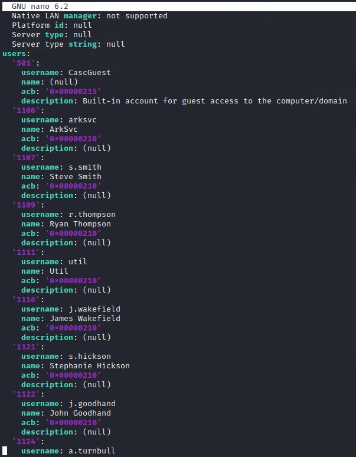

2. groups:

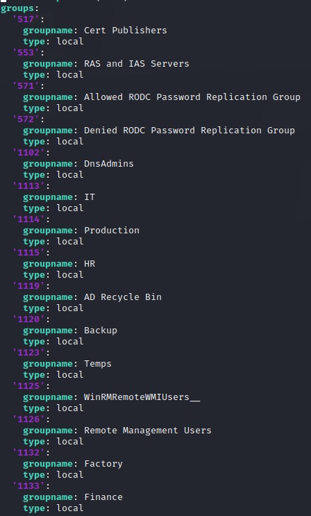

3. password policy:

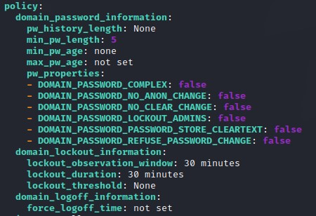

This is great! We have a userlist that we can use to do ASREPRoasting and we can do Password Spraying without locking anyone out.

### ASREPRoasting
To save time, we're going to do the ASREPRoast because it's a quick check and has a high change of giving us creds if we can crack the hash.

Command: `GetNPUsers.py -dc-ip 10.10.10.182 -request -debug -usersfile users.txt cascade.local/`

Note: I generally prefer to user the `-debug` flag. It can save me a lot of time in troubleshooting.

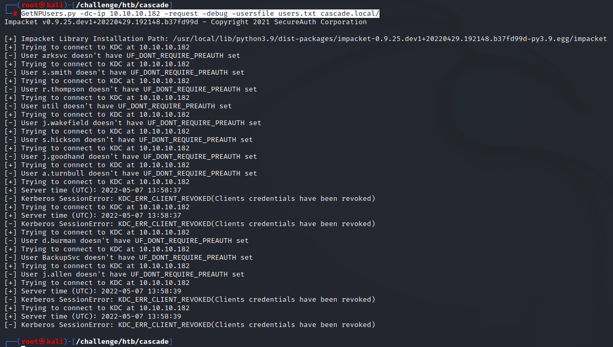

We find no accounts that don't require kerberoes preauthentication.

we also notice some accounts did get another type of error: `KDC_ERR_CLIENT_REVOKED(Clients credentials have been revoked)`. more on that later :)

### Time Saving: Password Spraying in the background
Since the password policy contained to user lockout, we're good to go spraying :D

Command: `for i in $(cat /opt/Seclists/Passwords/Common-Credentials/500-worst-passwords.txt); do kerbrute passwordspray --dc 10.10.10.182 -d cascade.local users.txt $i | grep -oP '\[\+\].*'; done`

what this does: it will spray using common passwords and only show us the output if it catches something. This is mainly to avoid filling up the screen with junk.

Note on the error we get when ASREPRoasting: we know during spraying that the users that got the `KDC_ERR_CLIENT_REVOKED` were in fact locked out.

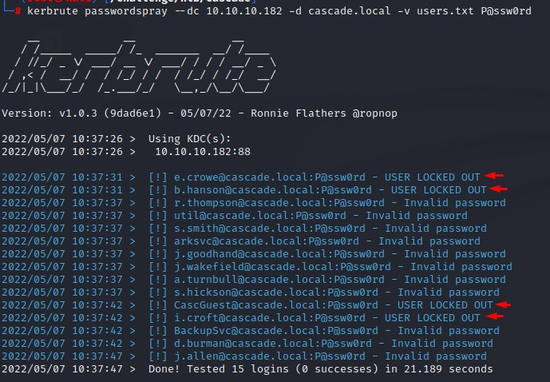

### SMB Enumeration
While we have our spray running, we're going to enumerate SMB shares using `crackmapexec`

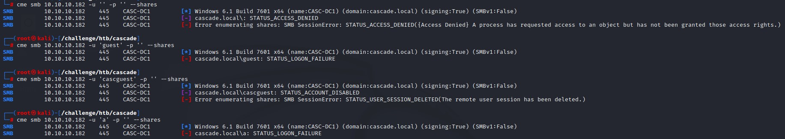

Notice that we test with the `cascguest` user on the 3rd attempt. This is because it was there in the `enum4linux-ng` output.

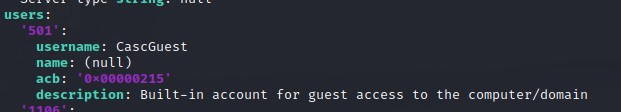

### LDAP
We're going to enumerate LDAP and see if we can find something there.

Command: `ldapsearch -x -H ldap://10.10.10.182 -b 'dc=cascade,dc=local'`

The output was huge. So we can saved it to `ldap-output`

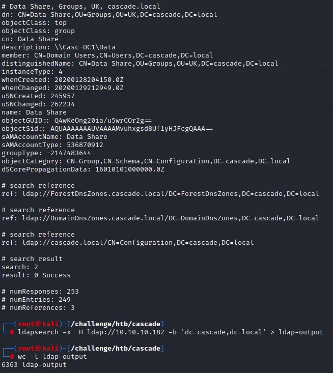

we're going to use a `grep` with some Regex kung fu to get rid of any unnecessary information.

Regex: `^\w+:`

English: Get us any line that starts (`^`) with a bunch of characters (`\w+`) followed by a semicolon (`:`).

We then follow up with a `sort` using the `-u` flag to get only unique attributes.

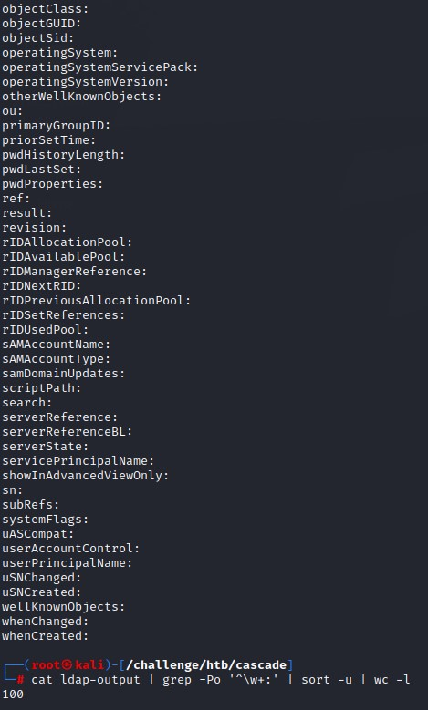

While we were filtering the attributes, we came across this:

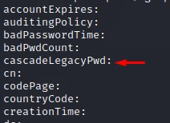

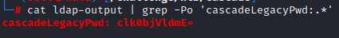

Since it had an `=` at the end, we try to decode it using `base64 -d`

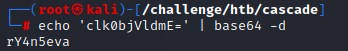

This attribute belonged to the `r.thompson` user.

We succeed when using it for authentication. But get no code execution with WinRM :/

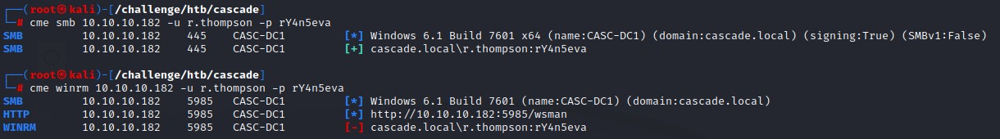

### Kerberoasting
With the same strategy as before, we're going to kerberoast.

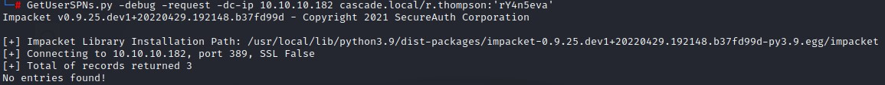

No results there.

### Enhanced Spraying with Password Pattern Recognition


### SMB Access with `R.Thompson`
We're going to user a `crackmapexec` module called `spider_plus`.

It essentially crawls the `SMB` share and returns a list of files that we have access to.

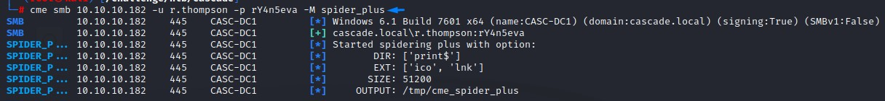

Here's what it found:

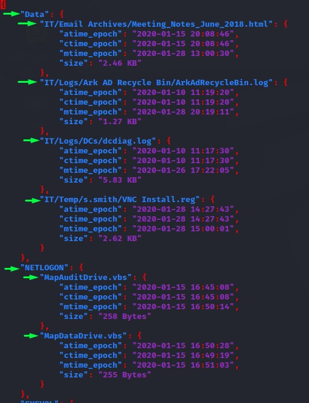

In the `Data` share, the contents of the `Meeting_Notes_June_2018.html` are interesting:

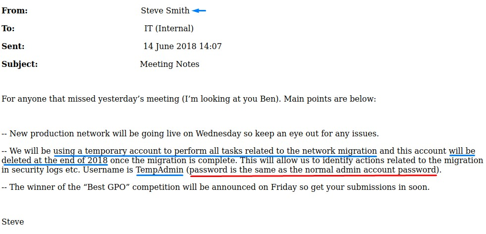

When we look at the `ArkAdRecycleBin.log` we get a confirmation that the `TempAdmin` user has been deleted.

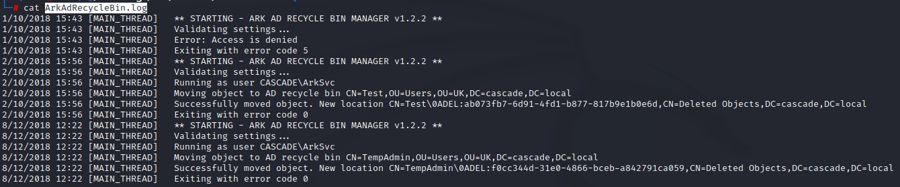

We find something very intersting in the `VNC Install.reg` file:

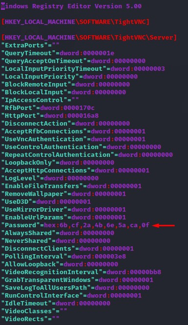

### Cracking VNC Passwords
We're interesting in cracking this VNC password and reusing it.

Luckily, a tool called `vncpwd` (https://github.com/jeroennijhof/vncpwd) can easily do that.

we clone the repo using `git clone https://github.com/jeroennijhof/vncpwd` and follow up with a `make` command to build it.

We then get the hex string and reverse it with `xxd` using the `-r` and `-p` flags before decrypting it.

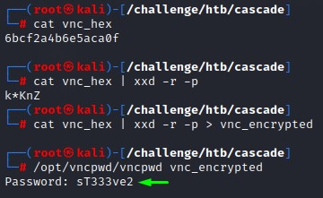

### Password Reuse
Having a new password `sT333ve2` we're going to to spray it all over the domain users we've collected.

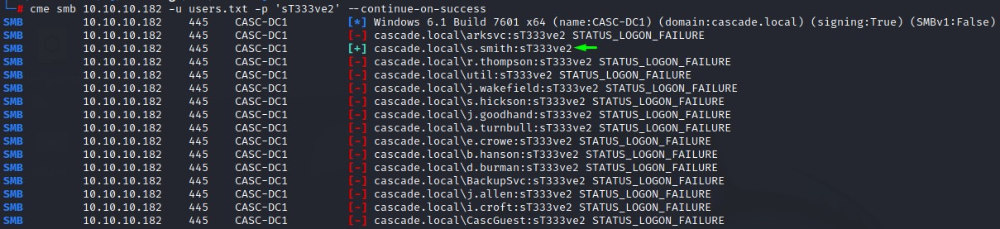

As expected, the password belonged to the `s.smith` user.

He also has WinRM access :D

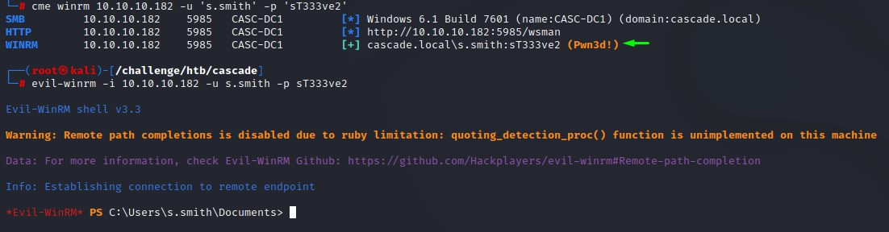

### Steve's SMB access: The `Audit$` Share
Using `crackmapexec` with the `--shares` flag, we get the below:

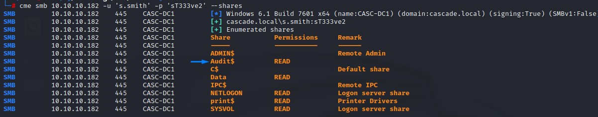

we mount the share with: `mount -t cifs -o 'username=s.smith,password=sT333ve2' //10.10.10.182/Audit$ /mnt`

and list the files with: `find /mnt -type f 2>/dev/null`

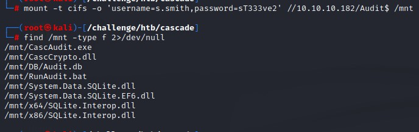

Checking the `.bat` file, we find that the executable `CascAudit.exe` runs with an argument `"\\CASC-DC1\Audit$\DB\Audit.db"`

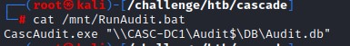

From the SQLite `.dll` files, we infer that the `.db` file is of that type. We confirm that with `file`

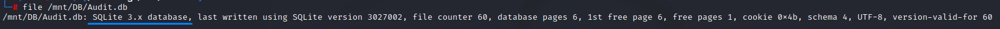

### DB Enumeration
We're going to use the `sqlite3` command-line utility to check out the database contents.

1. we list the tables with: `.tables`
2. we get the schema using `.schema`
3. we notice the `pwd` field in the `Ldap` table and select everything from it.
4. we get all contents from the `DeletedUserAudit` table and find no new data.
5. we find no data in the `Misc` table

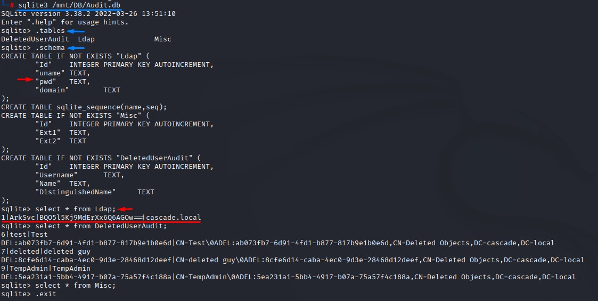

We find a password in the `Ldap` table that appears to be for the `ArkSvc` user.

Decoding it as base-64 gives us strange output. It must be encrypted.

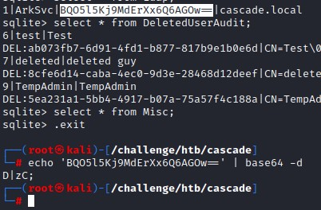

### Reversing the `CascAudit.exe` and `.dll` files
Since the `.bat` file showed the `CascAudit.exe` processing the Audit database, we're interested to know how it works.

We're also very interested in knowing more about the `CascCrypto.dll` because its name suggests being related to the encryption.

Doing a `file` command against the `CascAudit` files tells us they are built with `.Net`

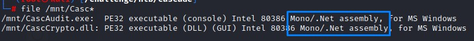

Thankfully, an amazing tool called `DNSpy` (https://github.com/dnSpy/dnSpy) is excellent in reversing `.Net`

Opening the `CascCrypto.dll` shows two important functions: `EncryptString` and `DecryptString`

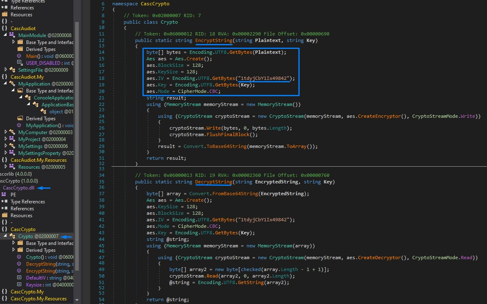

A great deal of information is present regarding the encryption:
1. Type: AES
2. BlockSize: 128-bit
3. KeySize: 128-bit
4. Initialization Vector: `1tdyjCbY1Ix49842`
5. Mode: CBC

only the key is left to be able to decrypt the `ArkSvc` password found in the DB. Or so we hope :D

We find the key in the `.exe` code

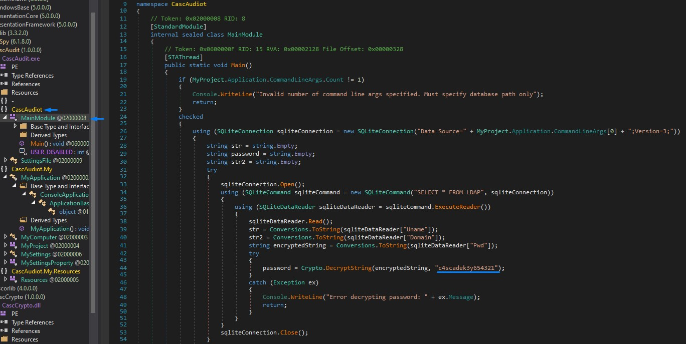

it is: `c4scadek3y654321`

It seems that the `.exe` reads the encrypted password and decrypts using the `DecryptString` function before moving on to carry out its task.

### AES-CBC-128 Decryption
Adding the details we found into an online decryption tool (https://www.devglan.com/online-tools/aes-encryption-decryption), we get the plaintext: `w3lc0meFr31nd`

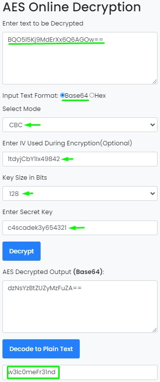

### ArkSvc and the AD Recycle Bin
The user `ArkSvc` authenticates successfully with the `w3lc0meFr31nd` password and also has `WinRM` access.

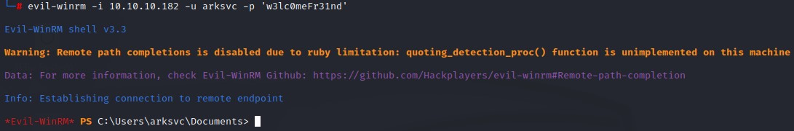

The group membership of this user is very interesting:

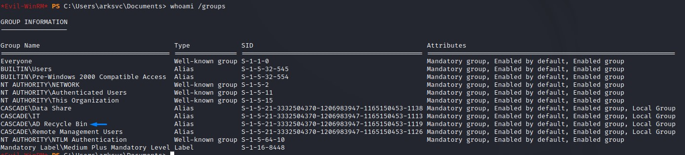

`s.smith` didn't have this access:

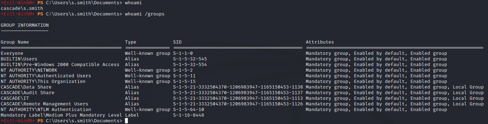

we're interested in the Recycle Bin of Active Directory because it has the `TempAdmin` user who might have a similar password to what we have.

We try restoring him using `PowerShell`

The command has 3 parts:
1. Fetching all deleted objects: `Get-ADObject -ldapFilter:"(msDS-LastKnownRDN=*)" -IncludeDeletedObjects`
2. Selecting last one (TempAdmin): `Select -Last 1 `
3. Restoring It: `Restore-ADObject`

But that fails :/

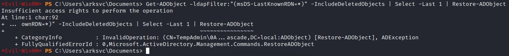

I scratch my head for a while...

But eventually get the idea of checking all the attributes for the `TempAdmin` user.

Just in case he had his password in one of them like the `r.thompson` user or something.

Command: `Get-ADObject -ldapFilter:"(msDS-LastKnownRDN=*)" -IncludeDeletedObjects -Properties * | Select -Last 1`

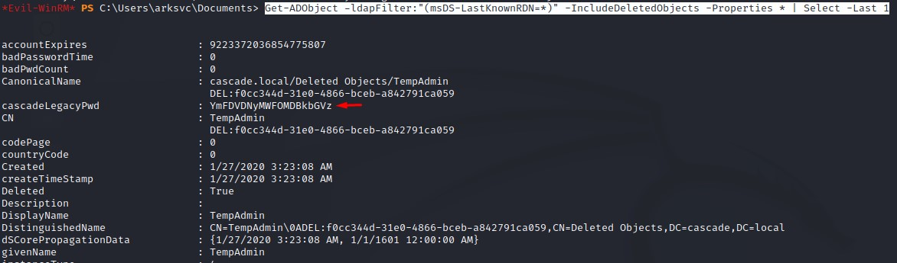

Son of a ... It was indeed the case XDD

And of course, it was base-64 encoded.

We decode it and use it with the `Administrator` user since that's what was mentioned in the email:

```
Username is TempAdmin (password is the same as the normal admin account password)
```

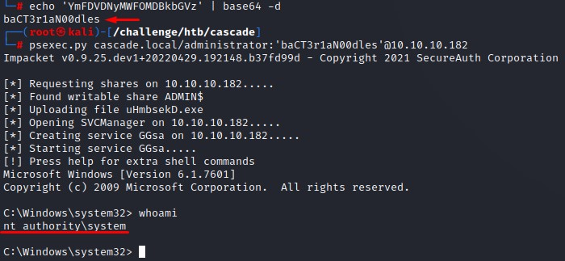

And we finally owned the box after all following those breadcrumbs XD