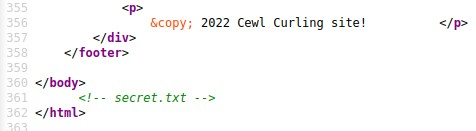

We start up by doing the standard nmap with `-sC` and `-sV` flags:
```
PORT   STATE SERVICE VERSION
22/tcp open  ssh     OpenSSH 7.6p1 Ubuntu 4ubuntu0.5 (Ubuntu Linux; protocol 2.0)
| ssh-hostkey: 
|   2048 8a:d1:69:b4:90:20:3e:a7:b6:54:01:eb:68:30:3a:ca (RSA)
|   256 9f:0b:c2:b2:0b:ad:8f:a1:4e:0b:f6:33:79:ef:fb:43 (ECDSA)
|_  256 c1:2a:35:44:30:0c:5b:56:6a:3f:a5:cc:64:66:d9:a9 (ED25519)
80/tcp open  http    Apache httpd 2.4.29 ((Ubuntu))
|_http-generator: Joomla! - Open Source Content Management
|_http-title: Home
|_http-server-header: Apache/2.4.29 (Ubuntu)
Service Info: OS: Linux; CPE: cpe:/o:linux:linux_kernel
```
The `http-generator` NSE script showed Joomla as the web app on port 80. so we go ahead and check it out.


We notice two potential usernames:
1. `super user`
2. `floris`

which could be of use. so we note them down. and try logging in with weak passwords like:
- password
- Password
- P@ssw0rd
- P@$$w0rd
- admin
- root

but they don't work with either users.

so we visit `http://10.10.10.150/README.txt` to check out Joomla's version and we notice it is **3.8**


we try doing a quick searchsploit excluding Joomla Components (*since there were a TON of them!*). but see no clear match of the version we detected.


so we check to see if we can run a specialized scanner for Joomla (*since it's a famous CMS*). After some research, we find a tool called `joomscan`. We check out its help file and notice it's pretty straight forward. It accepts the `url` and give us the option to enumerate compoents using the `-ec` flag. *This could benefit us since we have noticed a million exploits for vulnerable Joomla components*.


After running a scan, we find that:
- There wasn't a firewall detected. which is nice i guess.
- The Joomla version was indeed 3.8.8 and wasn't vulnerable.
- The Administrator panel is at `http://10.10.10.150/administrator/`
- we find `directory listing` enabled on a couple of interesting urls:
	1. `/administrator/components`
	2. `/administrator/modules`
	3. `/administrator/templates`
- we find the components within the cms:
	1. com_ajax
	2. com_banners
	3. com_contact
	4. com_content
	5. com_contenthistory
	6. com_fields
	7. com_finder
	8. com_mailto
	9. com_media
	10. com_newsfeeds
	11. com_search
	12. com_users
	13. com_wrapper

So we browse those directories for a bit to find out there wasn't much valuable information there.
We also do `searchsploit` queries for the components found but we don't find any exploits for them.

*Since the situation wasn't looking too good with the "looking for an exploit" path,* we go back to the basics and look at the source code of the home page.
And lo and behold! we find a comment right at the bottom saying `secret.txt`



it's the same result if we grep for comments after curling:


*Anyway,* we browse to `/secret.txt` to find some text:


I immediately try the text as the password on the admin panel with the users:
1. floris
2. superuser
3. admin
4. administrator

but nothing!

Even though, this file being hidden in the comments and being called secret.txt are factors making me consider this is something important. Something must be missing. I go for a walk and come back to decide maybe this text isn't a randomly generated password and is encrypted or something. So i drop it onto `CyberChef` (https://gchq.github.io/CyberChef/). It was a base64 encoded text: `Curling2018!`.


We use this with the `floris` user and we are logged in as the `Super User`! I was talking to myself like "why you no think of this earlier?" XD


Being logged in as the administrative user on Joomla means an easy shell.

`Extensions -> Templates -> Templates --> Select the Theme in Use --> Edit Index.php for a PHP reverse shell`

Not the most stealthy option I know. But this is HTB XD

*If it were a real life scenario though,* I would have set up a small payload like `php exec($_REQUEST["cmd"]);`

