### Summary
- A **windows machine** with `Anonymous FTP` allowed. *Inspecting the contents* reveals a **documents folder** one of which tells us that *RTF documents are being reviewed and converted by someone*.
- *Using this information,* we craft a *malicious document* using **CVE-2017-0199** and send it to a certain user called `nico` via the open `SMTP` port (*We find his username by checking the metadata of the documents on FTP*).
- *When the document is opened,* we get a shell back as `nico` and start enumerating the machine.
- *With BloudHound,* we find that nico has a `WriteOwner` right over another user `herman` who has a `WriteDACL` over a certain group called `Backup_Admins`.
- We abuse the `WriteOwner` right to grant ourselves the right to reset `herman`'s password and abuse the `WriteDACL` to add him to the `Backup_Admins` group.
- We then find out that `Backup_Admins` have access to a certain folder called `Backup Scripts` on the `Administrator`'s desktop on the box.
- *Within that folder,* we find a script that contains the password for the local administrator which works and we use it to login using the open `SSH` port.
- A *Similar path* exists with another user `tom` whom his credentials are present in a `creds.xml` file on `nico`'s desktop as a `secure string`.
- The clear-text credentials can be retrieved to gain access as `tom` using `SSH`. `tom` has `WriteOwner` on `claire` who has a `WriteDACL` on `Backup_Admins`.
- Another path exists with abusing the `SeLoadDriverPrivilege` held by `tom` since he's a member of the `Print Operators` group.
- The box is also vulnerable to `CVE-2018-8440` and `CVE-2019-1458` local privilege escalation exploits.

---

### Nmap
Checking the `nmap` scan, we find very few ports running:
```
PORT   STATE SERVICE VERSION                                                                                      
21/tcp open  ftp     Microsoft ftpd                                                                               
| ftp-syst:                                                                                                       
|_  SYST: Windows_NT                                                                                              
| ftp-anon: Anonymous FTP login allowed (FTP code 230)                                                            
|_05-29-18  12:19AM       <DIR>          documents                                                                
22/tcp open  ssh     OpenSSH 7.6 (protocol 2.0)                                                                   
| ssh-hostkey:                                                                                                    
|   2048 82:20:c3:bd:16:cb:a2:9c:88:87:1d:6c:15:59:ed:ed (RSA)            
|   256 23:2b:b8:0a:8c:1c:f4:4d:8d:7e:5e:64:58:80:33:45 (ECDSA)           
|_  256 ac:8b:de:25:1d:b7:d8:38:38:9b:9c:16:bf:f6:3f:ed (ED25519)         
25/tcp open  smtp?                                                                                                
| fingerprint-strings:                                                                                            
|   DNSStatusRequestTCP, DNSVersionBindReqTCP, Kerberos, LDAPBindReq, LDAPSearchReq, LPDString, NULL, RPCCheck, SMBProgNeg, SSLSessionReq, TLSSessionReq, X11Probe: 
|     220 Mail Service ready                                                                                      
|   FourOhFourRequest, GenericLines, GetRequest, HTTPOptions, RTSPRequest: 
|     220 Mail Service ready                                                                                      
|     sequence of commands                                                                                        
|     sequence of commands                                                                                        
|   Hello:                                                                                                        
|     220 Mail Service ready                                                                                      
|     EHLO Invalid domain address.                                                                                
|   Help:                                                                                                         
|     220 Mail Service ready                                                                                      
|     DATA HELO EHLO MAIL NOOP QUIT RCPT RSET SAML TURN VRFY              
|   SIPOptions:                                                                                                   
|     220 Mail Service ready                                                                                      
|     sequence of commands                                                                                        
|     sequence of commands
|     sequence of commands                              
|     sequence of commands
|     sequence of commands                                                                                        
|     sequence of commands                                                                                        
|     sequence of commands
|     sequence of commands                    
|     sequence of commands
|     sequence of commands
|     sequence of commands
|   TerminalServerCookie: 
|     220 Mail Service ready
|_    sequence of commands
| smtp-commands: REEL, SIZE 20480000, AUTH LOGIN PLAIN, HELP
|_ 211 DATA HELO EHLO MAIL NOOP QUIT RCPT RSET SAML TURN VRFY
```

### Anonymous FTP
Checking FTP, we come across 3 files:
- Applocker.docx
- readme.txt
- Windows Event Forwarding.docx

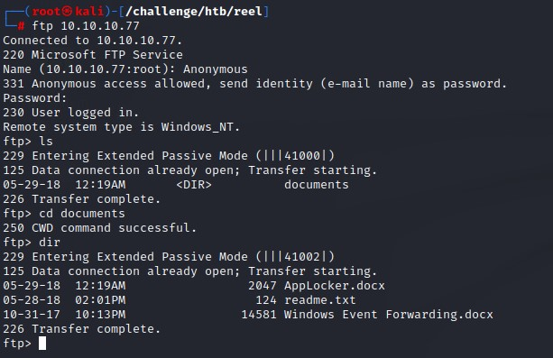

### Contents of readme.txt
```
please email me any rtf format procedures - I'll review and convert.

new format / converted documents will be saved here.
```

### Looks like we're going phishing :D
the content is about someone asking to be emailed RTF formats (a type of document) for him/her to review and convert.

This seems like a phishing challenge. We need to:
1. Find out who that user is
2. Find a way to create a malicious RTF file
3. Find a way to send emails using the open SMTP port

### Enumerating SMTP
We use a tool called `smtp-user-enum` which lets us find if a given user exists or not.

It uses a couple of SMTP commands to do that:
1. VRFY
2. EXPN
3. RCPT

we give it a list of male/female names from the `SecLists` Github Repo to try while we look at how to create a malicious document.

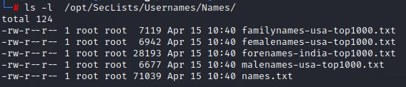

the command is:

`smtp-user-enum -M VRFY -U users.txt -t 10.10.10.77`

That takes a while to run. And it comes up short. So we move on.

### Checking file metadata using `exiftool`

When we run `exiftool` against the `Windows Event Forwarding.docx` file, we do find a user called `nico` whose email is `nico@megabank.com`

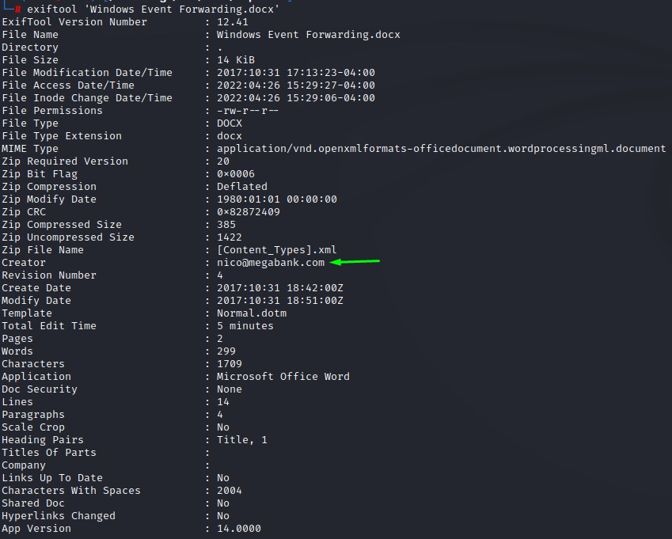

we note this down and go to verify this user using `smtp-user-enum`

### Trying various SMTP methods for enumeration

when testing mulitple methods with the `nico` user, we still get no hits.

However, we do get a verification when add the `-D` flag and supply `megabank.com` as the domain.

But this is only with the `RCPT` method:

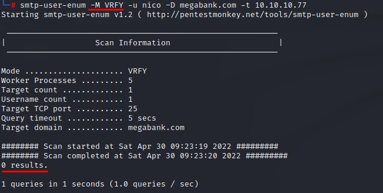

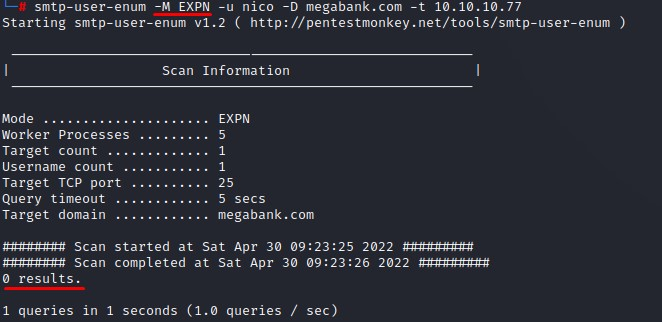

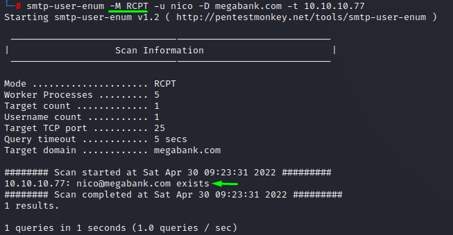

### Working on the phish

Doing a google search shows an article about CVE-2017-0199 which looks promising.

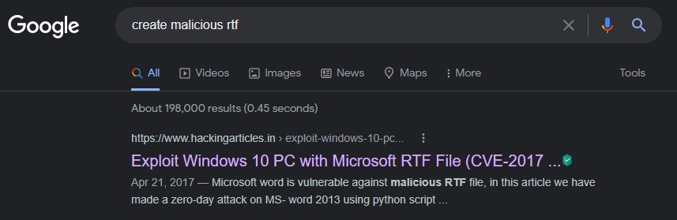

According to the article, we should clone a repo (https://github.com/bhdresh/CVE-2017-0199.git) to get a python script.

We look at the help:

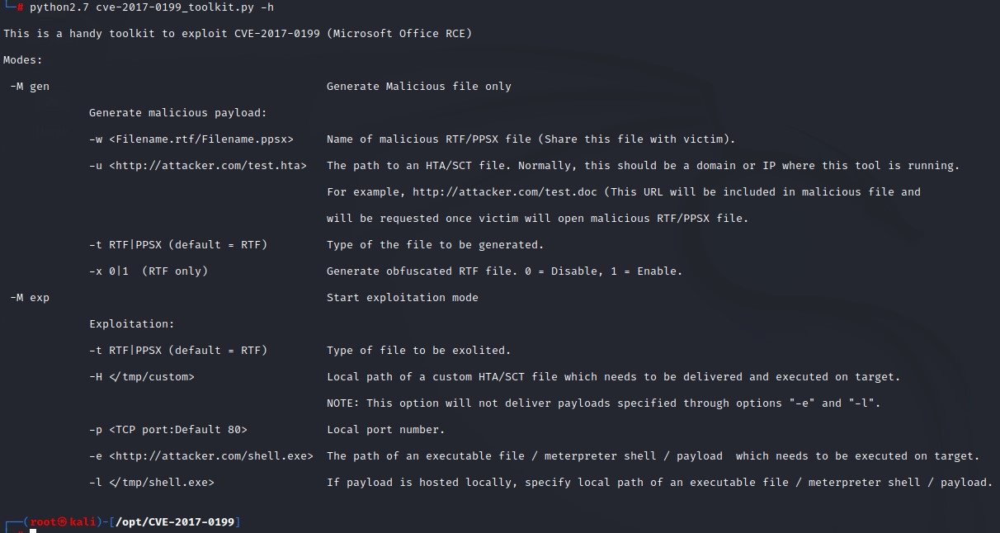

We need to first generate a malicious `RTF` document using the first mode `gen` and supply a url of an `HTA` file to achieve code execution.

Let's generate the evil `HTA` file using `msfvenom`

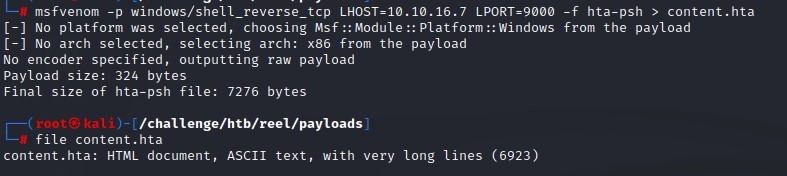

And create the evil `RTF` and call it `review.rtf` to look benign

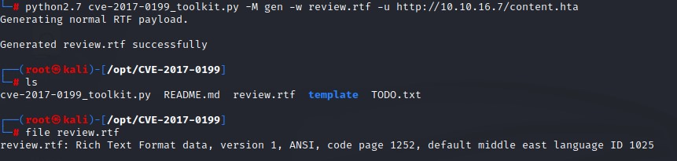

We host the payload on our kali machine using a standard `python3` webserver and start our listener with `nc -lvnp` on port 9000

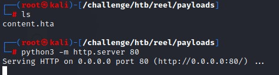

What's left is to send the email to `nico@megabank.com`

we're going to use the `sendEmail` command with a couple flags:
- `-t <RECEPIENT>`
- `-f <SENDER>`
- `-s <SMTP_SERVER>`
- `-u <MAIL_SUBJECT>`
- `-a <PATH_TO_ATTACHMENT>`
- `-m <MESSAGE_BODY>`

Our command is:
```
sendEmail \
-t nico@megabank.com \
-f review@megabank.com \
-s 10.10.10.77 \
-u 'Document for Review' \
-a /opt/CVE-2017-0199/review.rtf \
-m 'Kindly review the attached document. Just press OK if you get an error while opening it and it should be fine.'
```

We try to look non-suspicous as possible. And use a subtle message body to have the user click 'OK' if he gets an error message (which does happen with this exploit).

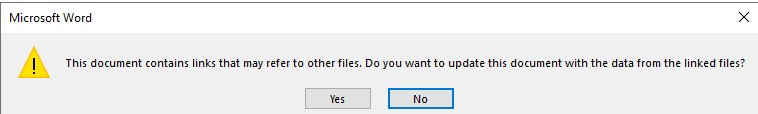

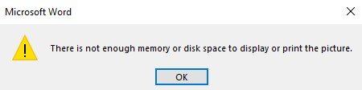

### Triggering the exploit chain
Having everything ready, we trigger the chain:

1. Send the malicious `RTF` file
2. The `RTF` calls back to the `HTA` payload hosted on our kali machine
3. The `HTA` file is executed and returns a shell on our listening host

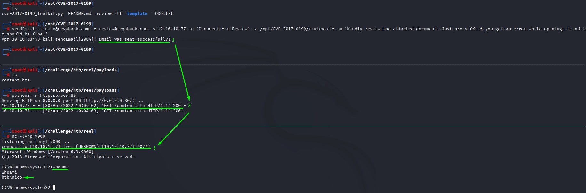

### Brief note on the article content

The guide talks about using an `exe` file. We cannot do so because of `Applocker`.

It was mentioned that the user has set up hash rules for multiple file types:

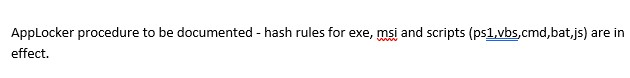

This is why we generated an HTA payload using `msfvenom` instead.