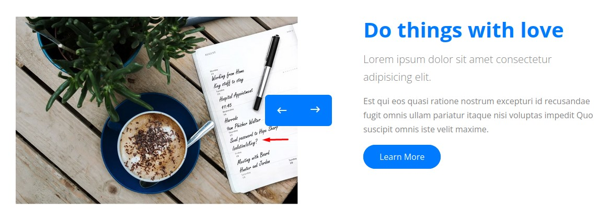
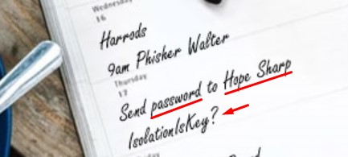

### Summary
1. A Windows Domain Controller Machine where we don't get any access using traditional methods. They key to gaining our initial set of credentials is by inspecting one of the images on the website that turns out to have credentials for a user called `hope.sharp`
2. Using this authenticated access, we run a kerberoast attack which gets the hash of the `web_svc` account which we crack its hash to get a password.
3. When spraying this password across the domain users, we find out that the same password is reused by another user: `edgar.jacobs`.
4. Edgar's redirected folder was exposing his user profile which contained an interesting Microsoft Excel document called `Phishing_Attempt.xlsx`.
5. When closely checking the contents of this sheet, we find a hidden column which cannot be viewed because it was protected.
6. Uploading the Excel workbook to Google sheets does the trick and we're able to view the hidden column which turned out to a set of passwords.
7. One of the passwords worked for a certain user called `sierra.frye` which had the permission to read the GMSA password of `BIR-ADFS-GMSA$`.
8. That account has a `WriteDACL` right on a Domain Administrator called `tristan.davies`.
9. We use a python script to retrieve the NTLM hash of `BIR-ADFS-GMSA$` and abuse his rights to reset the password of `tristan.davies` via RPC.
10. When trying to get a shell on the box, Antivirus stops us. So we get around that by enabling PowerShell Remoting then using `evil-winrm`.
11. Another route that is a bit longer includes using the PowerShell Web Access enabled on the web server after cracking then importing a `.pfx` certificate into our browser. One we found on the shared user profile of the `sierra.frya` user.

---

### Nmap
```
PORT      STATE SERVICE       VERSION
53/tcp    open  domain        Simple DNS Plus
80/tcp    open  http          Microsoft IIS httpd 10.0
|_http-server-header: Microsoft-IIS/10.0
| http-methods: 
|_  Potentially risky methods: TRACE
|_http-title: Search &mdash; Just Testing IIS
88/tcp    open  kerberos-sec  Microsoft Windows Kerberos (server time: 2022-06-25 20:46:51Z)
135/tcp   open  msrpc         Microsoft Windows RPC
139/tcp   open  netbios-ssn   Microsoft Windows netbios-ssn
389/tcp   open  ldap          Microsoft Windows Active Directory LDAP (Domain: search.htb0., Site: Default-First-Site-Name)
| ssl-cert: Subject: commonName=research
| Not valid before: 2020-08-11T08:13:35
|_Not valid after:  2030-08-09T08:13:35
|_ssl-date: 2022-06-25T20:48:22+00:00; 0s from scanner time.
443/tcp   open  ssl/http      Microsoft IIS httpd 10.0
|_ssl-date: 2022-06-25T20:48:22+00:00; 0s from scanner time.
|_http-title: Search &mdash; Just Testing IIS
|_http-server-header: Microsoft-IIS/10.0
| http-methods: 
|_  Potentially risky methods: TRACE
| tls-alpn: 
|_  http/1.1
| ssl-cert: Subject: commonName=research
| Not valid before: 2020-08-11T08:13:35
|_Not valid after:  2030-08-09T08:13:35
445/tcp   open  microsoft-ds?
464/tcp   open  kpasswd5?
593/tcp   open  ncacn_http    Microsoft Windows RPC over HTTP 1.0
636/tcp   open  ssl/ldap      Microsoft Windows Active Directory LDAP (Domain: search.htb0., Site: Default-First-Site-Name)
| ssl-cert: Subject: commonName=research
| Not valid before: 2020-08-11T08:13:35
|_Not valid after:  2030-08-09T08:13:35
|_ssl-date: 2022-06-25T20:48:22+00:00; 0s from scanner time.
3268/tcp  open  ldap          Microsoft Windows Active Directory LDAP (Domain: search.htb0., Site: Default-First-Site-Name)
| ssl-cert: Subject: commonName=research
| Not valid before: 2020-08-11T08:13:35
|_Not valid after:  2030-08-09T08:13:35
|_ssl-date: 2022-06-25T20:48:22+00:00; 0s from scanner time.
3269/tcp  open  ssl/ldap      Microsoft Windows Active Directory LDAP (Domain: search.htb0., Site: Default-First-Site-Name)
| ssl-cert: Subject: commonName=research
| Not valid before: 2020-08-11T08:13:35
|_Not valid after:  2030-08-09T08:13:35
|_ssl-date: 2022-06-25T20:48:22+00:00; 0s from scanner time.
8172/tcp  open  ssl/http      Microsoft IIS httpd 10.0
|_ssl-date: 2022-06-25T20:48:22+00:00; 0s from scanner time.
|_http-server-header: Microsoft-IIS/10.0
|_http-title: Site doesn't have a title.
| tls-alpn: 
|_  http/1.1
| ssl-cert: Subject: commonName=WMSvc-SHA2-RESEARCH
| Not valid before: 2020-04-07T09:05:25
|_Not valid after:  2030-04-05T09:05:25
9389/tcp  open  mc-nmf        .NET Message Framing
49667/tcp open  msrpc         Microsoft Windows RPC
49675/tcp open  ncacn_http    Microsoft Windows RPC over HTTP 1.0
49676/tcp open  msrpc         Microsoft Windows RPC
49702/tcp open  msrpc         Microsoft Windows RPC
49716/tcp open  msrpc         Microsoft Windows RPC
49736/tcp open  msrpc         Microsoft Windows RPC
Service Info: Host: RESEARCH; OS: Windows; CPE: cpe:/o:microsoft:windows

Host script results:
| smb2-security-mode: 
|   3.1.1: 
|_    Message signing enabled and required
| smb2-time: 
|   date: 2022-06-25T20:47:44
|_  start_date: N/A
```

We see standard domain controller ports, IIS on ports 80, 443 & 8172 but no WinRM :/

### Stuff we tried but didn't work
1. SMB enumeration using anonymous, guest and null sessions.
2. RPC enumeration with `enum4linux-ng` didn't get much information.
3. LDAP enumeration with `ldapsearch` using anonymous authentication.
4. Collecting usernames from the website and trying them. We got 3 valid users. But none of them was ASREPRoastable or had a weak password.
5. Web directory bruteforcing. The only unique directory was `/staff` but we got access denied. We also did file bruteforcing with multiple extensions.
6. Viewing the source code for the accessible web pages.
7. Checking for virtual host routing.

All of those failed. Until...

### Actually, when you use a magnifying glass..
Looking really close at one of the images on the website, we found something:



The text was very small, so we had to open up the image in a new tab and zoom in to find what's written:



It said: "Send password to Hope Sharp" then "IsolationIsKey?"

### First set of credentials
Earlier, when extracted user names from the website:


we used a python tool called `ADGenerator` [here](https://github.com/w0Tx/generate-ad-username) to generate a list of username based on their first and last names following common naming conventions.

